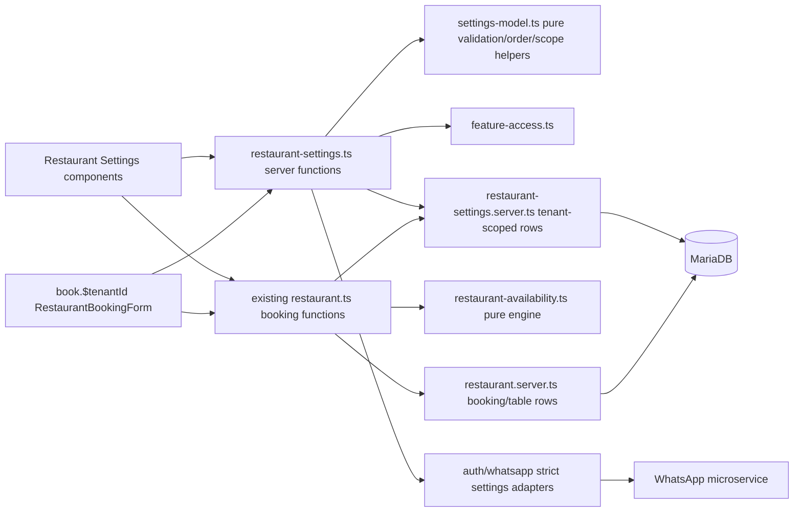
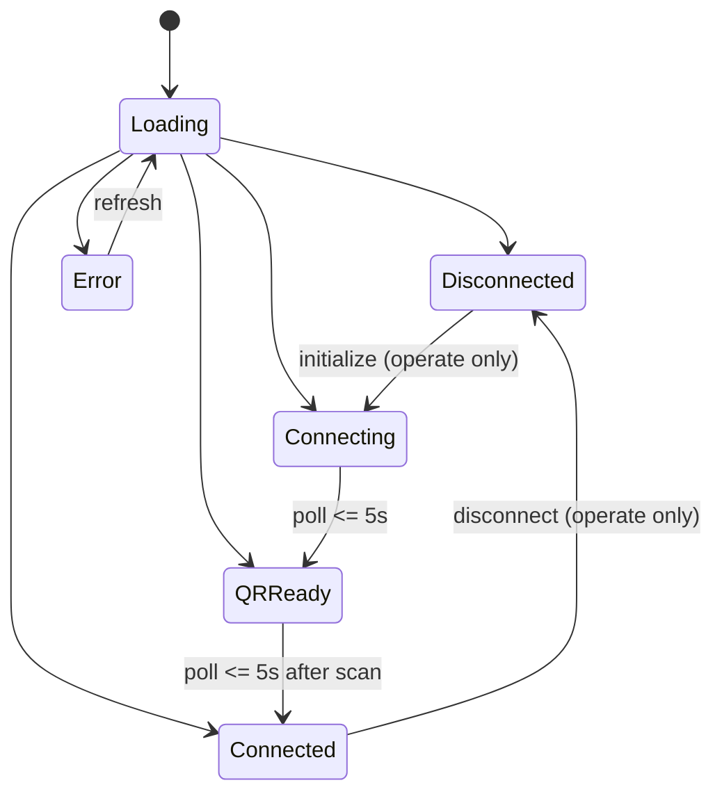

# Design Document

## Overview

This feature extends the existing Restaurant Dashboard Settings area from seven shallow sub-tabs to the approved nine-tab parity model without changing the booking engine, table-booking transaction model, or any non-restaurant dashboard. The implementation reuses the current TanStack Start route, raw MariaDB access layer, pure feature-access resolver, pure restaurant availability core, WhatsApp microservice client, and category-dashboard interaction patterns.

The approved requirements are the source of truth. In particular, this design intentionally supersedes the `restaurant-table-booking` rule that hid `Restaurant Profile` when `restaurant_config` was unavailable: Profile is always visible, while profile mutations remain permission-gated and self-service account security remains available to the signed-in account.

### Repository research findings

- `src/routes/dashboards/restaurant.tsx` already provides the responsive Settings shell, but its canonical list lacks `Dining Areas` and `Menu`; Profile has no account-security section, hours have no presets/calendar, and users support only create/delete.
- The five category dashboards, represented by `src/routes/dashboards/medical.tsx`, establish the product patterns for profile security, hour presets, blocked-date calendars, complete user management, WhatsApp pairing, and multi-location terminology. New restaurant behavior is extracted into restaurant components rather than copied into the large category route files.
- `src/lib/restaurant-availability.ts` is the deterministic, I/O-free availability engine. Both public availability and booking creation use snapshots assembled in `src/lib/restaurant.ts`; closure data must enter that same snapshot so the public read and transactional booking recheck cannot disagree.
- Production persistence is raw MariaDB initialized by idempotent DDL in `src/lib/db.ts`. `prisma/schema.prisma` is currently a partial tooling mirror and is not used by restaurant row access. The implementation updates both the runtime schema and Prisma mirror, but does not introduce Prisma calls into the restaurant path.
- `src/lib/feature-access.ts` already separates inherited plan availability from role permission. New writes must use that resolver server-side; hard-coded `role === "admin"` checks and client-only hiding are insufficient.
- Restaurant tables already carry nullable `locationId`; most settings reads currently trust optional client scope or read all locations. The new scope resolver derives branch scope from the authenticated session and validates owner-selected branches before any row access.
- `src/lib/auth.ts` contains reusable profile, OTP, WhatsApp, SubUser, and Location flows, but several are not role-complete or feature-guarded. This design introduces focused settings boundaries and shared guards rather than exposing those existing shortcomings through the restaurant UI.

### Design decisions

1. **Keep weekly hours and booking rules tenant-global.** Requirement 9 explicitly location-scopes tables, dining areas, menu records, and closure days, but not `RestaurantSettings` or `RestaurantHours`. Branches therefore share timezone/hours/rules while owning the listed branch resources.
2. **Represent primary scope as `locationId IS NULL`.** This preserves `restaurant-table-booking`. Owner-without-selection and public `/book/{tenantId}` use primary scope; a branch session is forced to its own `Location.id`; an owner may select a validated branch in Settings.
3. **Preserve `RestaurantTable.area` during registry migration.** Dining areas are a managed registry, while the existing string remains the compatibility/display value. New table writes select a registry record and persist its canonical name; no booking or historical table display is rewritten.
4. **Use a dedicated email-verification table.** Existing `OtpCode` is shared and keyed only by email. Account email changes require account-bound, expiring codes and resend timing without changing signup/reset OTP behavior.
5. **Use strict WhatsApp status reads in Settings.** Existing notification code intentionally degrades transport errors. The Settings panel needs an explicit `ERROR` state, so it uses a strict status API while booking notifications retain their tolerant behavior.

### Goals

- Map all eleven requirements to concrete UI, server, persistence, authorization, location-scope, and test contracts.
- Preserve existing restaurant booking concurrency, booking history, feature inheritance, and all five legacy public booking flows.
- Make validation/order/availability behavior pure and property-testable; keep I/O thin and tenant-scoped.

### Non-goals

- No production implementation in this phase.
- No branch-specific weekly hours, booking rules, restaurant profile, WhatsApp session, or user directory.
- No change to table joining, deposits, pre-orders, floor-plan coordinates, or the five non-restaurant booking flows.
- No new public branch chooser: `/book/{tenantId}` continues to address primary scope. Existing optional location plumbing remains available for a separately linked branch flow, but is not expanded by this feature.
## Architecture

### Module and data flow



New settings concerns live in `src/lib/restaurant-settings-model.ts` (pure contracts and validators), `src/lib/restaurant-settings.server.ts` (raw row access), and `src/lib/restaurant-settings.ts` (TanStack `createServerFn` boundary). Existing table/hours/rules APIs stay in `restaurant.ts`, but consume the shared scope resolver and closure snapshot. This avoids destabilizing the proven booking transaction while preventing validation logic from being duplicated in React.

### Request authorization and scope pipeline

Every authenticated settings server function executes these steps in order:

1. `verifySession()` resolves the active account and parent tenant context.
2. `resolveFeatureAccess(context)` enforces the relevant feature: `restaurant_config`, `users`, `locations`, or `whatsapp`. Reads require visible/use permission; writes require `operate`.
3. `resolveRestaurantResourceScope(session, requestedLocationId)` returns `{tenantId, locationId}`:
   - `role === "location"`: require `session.locationId`; reject a different requested id and force the session id.
   - `role === "admin"`: absent selection resolves to `null`; a supplied id must be an active or inactive `Location` belonging to the same tenant.
   - `reception`/`doctor`: resolve to `null`; they cannot select a branch.
4. Pure validation normalizes trimming/defaults and returns all field errors.
5. Row access includes `tenantId = ?` and, for branch resources, `locationId <=> ?`. Identifier lookups that do not match both constraints return not found.
6. Mutation and dependent counts/cascades execute in one transaction where atomicity is required.

This pipeline preserves `sub-location-feature-inheritance`: the parent plan determines availability, role determines permission, inactive child sessions fail before row access, and location role never escapes its own branch.

### Settings navigation and responsive state

`deriveRestaurantNavigation` remains the pure source for visibility, with a revised settings contract:

```ts
const SETTINGS_ORDER = [
  "Restaurant Profile", "Operating Hours", "Dining Areas", "Tables", "Menu",
  "Booking Rules", "WhatsApp Alerts", "Multi Location", "Manage Users",
] as const;
```

- `Restaurant Profile` is always first for any account that reached Settings, including `restaurant_config: none` and unresolved feature access.
- The five config tabs (`Operating Hours`, `Dining Areas`, `Tables`, `Menu`, `Booking Rules`) appear only for `operate` or `view_only`.
- WhatsApp, locations, and users appear exactly when their resolved feature is visible.
- A missing or invisible requested sub-tab falls back to the first visible item. Unresolved access yields only Profile plus `MSG_FEATURE_ACCESS_UNRESOLVED`.
- The empty-state branch remains defined for defensive compatibility, although Profile normally makes it unreachable after route admission.
- Selected sub-tab and owner-selected branch are route-level state. Changing branch invalidates all location-scoped queries and resets resource dialogs; it does not change Profile, hours, rules, users, locations, or WhatsApp state.
- Below 768 px, the existing `md:hidden` single-select dropdown is retained with `aria-current`/selected text. At 768 px and above, `hidden md:flex` renders the horizontal bar. Only the active panel is mounted, preventing hidden panels from polling or mutating.

### Availability and closure integration

`loadSnapshot` is extended to fetch closure rows for the requested tenant, date, and resolved location. `AvailabilityInput` gains:

```ts
interface AvailabilityClosureInput {
  restaurantClosed: boolean;
  closedTableIds: readonly string[];
}
```

`computeAvailability` keeps existing indicator precedence: out-of-window remains first for compatibility; otherwise a weekly closed day or restaurant closure returns `{closed: true, slots: []}`. For an open date, table-scoped closures remove those table ids before capacity and occupancy evaluation. The same closure-aware computation is used by public reads, walk-ins, and `createBookingAtomic` under its existing table locks. Closure writes never update `Appointment`, so existing booking statuses and turn-time snapshots remain unchanged.

### Multi-location behavior

| Caller/context | Effective resource scope | May choose another scope? |
|---|---|---|
| Owner, no branch selected | `locationId IS NULL` | Yes, via owner-only branch selector |
| Owner, branch selected | selected validated `Location.id` | Yes |
| Branch account | session `locationId` | No |
| Reception/doctor | `locationId IS NULL` | No |
| Public `/book/{tenantId}` | `locationId IS NULL` | No new chooser |

Tables, areas, menu categories/items, and closure days use this scope. Tenant-wide limits (200 tables, 40 menu categories, 500 menu items) count all locations, as the approved requirements say “per Restaurant_Tenant.” Names remain tenant-wide case-insensitive where the requirements state tenant-wide uniqueness; the synthetic `Main` fallback is not a stored duplicate.

### Compatibility with existing specs

- Existing `RestaurantTable`, `RestaurantSettings`, `RestaurantHours`, `Appointment` restaurant columns, locking order, token allocation, and booking-status semantics remain intact.
- This feature is the approved exception to the old menu non-goal and Profile gating rule. Menu is additive to the restaurant branch of `book.$tenantId.tsx`; non-restaurant branches are untouched.
- Table closures participate in both availability display and transactional recheck, preserving the no-double-booking proof.
- Feature entitlement continues to come from the parent plan. The role matrix in `feature-access.ts` is not re-derived in UI code.
- Existing nullable `Appointment.locationId` and `RestaurantTable.locationId` conventions are retained.

## Components and Interfaces

### Settings route and components

| Component | Responsibility |
|---|---|
| `SettingsPanel` in `restaurant.tsx` | Heading/description, canonical selector, fallback behavior, branch selector, unresolved/empty messages, active-panel dispatch |
| `RestaurantProfilePanel` | Portal text/copy/QR, tenant profile, role-aware photo upload, always-available account security |
| `OperatingHoursSettings` | Seven rows, at least three presets, apply-to-open-days, atomic save, restaurant closure calendar |
| `DiningAreasSettings` | Ordered area registry, assigned table counts, create/delete, synthetic Main fallback |
| existing `TableManager` (extended) | Registry-backed area selector, table closure count and per-table closure calendar |
| `MenuSettings` | Ordered category/item editor, state toggle, limit display, cascade confirmation |
| existing `BookingRules` | Unchanged fields and global semantics; receives resolved permission |
| `WhatsAppAlertsSettings` | Alert config, strict session state, QR pairing, polling, refresh/disconnect/test controls |
| `RestaurantMultiLocationSettings` | Reuses shared location editor with Branch labels and explicit permission prop |
| `RestaurantUsersSettings` | Plan limits, create/edit/password/deactivate/delete with confirmations |
| `PublicRestaurantMenu` | Read-only available items in restaurant booking form; omitted for an empty available menu |

All mutating panels keep a `stored` snapshot separate from editable state. Presets and apply-to-all update only draft state. Failed saves restore or retain the stored snapshot and never show success. `view_only` and `none` render no mutation controls rather than merely disabling them.
### Pure settings model

`src/lib/restaurant-settings-model.ts` exports no database, auth, React, or network dependencies.

```ts
export type LocationScope = string | null;
export type ClosureScope = { type: "restaurant" } | { type: "table"; tableId: string };
export type MenuItemState = "available" | "unavailable";

export interface DiningArea { id: string; name: string; displayOrder: number; tableCount: number; locationId: LocationScope }
export interface ClosureDay { id: string; date: string; scope: ClosureScope; reason: string; isHoliday: boolean; affectedBookingCount: number; locationId: LocationScope }
export interface MenuCategory { id: string; name: string; displayOrder: number; items: MenuItem[]; locationId: LocationScope }
export interface MenuItem { id: string; categoryId: string; name: string; priceMinor: number; description: string; displayOrder: number; state: MenuItemState; locationId: LocationScope }

export function validateClosureDay(input: unknown): Result<NormalisedClosureDay>;
export function validateDiningArea(input: unknown, context: AreaContext): Result<NormalisedDiningArea>;
export function validateMenuCategory(input: unknown, context: MenuContext): Result<NormalisedMenuCategory>;
export function validateMenuItem(input: unknown, context: MenuContext): Result<NormalisedMenuItem>;
export function orderDiningAreas(rows: DiningArea[]): DiningArea[];
export function orderMenu(rows: MenuCategory[]): MenuCategory[];
export function applyHoursPreset(days: DayHours[], preset: HoursPreset): DayHours[];
export function applyHoursToOpenDays(days: DayHours[], open: string, close: string): DayHours[];
export function publicMenu(categories: MenuCategory[]): MenuCategory[];
```

Date validation round-trips calendar components rather than relying on permissive `Date.parse`: input must match `^\d{4}-\d{2}-\d{2}$`, construct a UTC date, and format back to the same string. Ordering always uses numeric display order then `localeCompare(..., undefined, {sensitivity: "base"})`, with id as a final deterministic tie-breaker.

Named hour presets are constants (for example `All Days 09:00–22:00`, `Weekdays 09:00–18:00`, and `Dinner Service 17:00–23:00`). Applying a preset replaces all seven draft rows including closed flags. Apply-to-all validates one open/close pair and changes times only on draft rows whose closed flag is false.

### Server functions

`src/lib/restaurant-settings.ts` exposes the following implementation boundaries. All authenticated writes perform authorization before validation-dependent row reads, and all ids are re-resolved under tenant and location scope.

| Server function | Method / access | Contract |
|---|---|---|
| `getRestaurantSettingsBootstrapServerFn` | GET / session | Navigation permissions, account identity, profile summary, branch choices, user/location plan messages |
| `getRestaurantProfileServerFn` | GET / any Settings account | Tenant profile plus current account email/photo and exact `/book/{tenantId}` path |
| `saveRestaurantProfileServerFn` | POST / `restaurant_config: operate` | Trim and atomically upsert tenant profile fields; synchronize compatible owner fields |
| `uploadRestaurantProfilePhotoServerFn` | POST / `restaurant_config: operate` | Validate decoded bytes/MIME/size, upload, then update role-specific account row |
| `requestAccountEmailChangeServerFn` | POST / self | Cross-account uniqueness, account-bound 4-digit code, 5-minute expiry, 60-second resend gate |
| `confirmAccountEmailChangeServerFn` | POST / self | Consume matching unexpired code and update the correct account table transactionally |
| `changeOwnPasswordServerFn` | POST / self | Verify current hash; validate length/confirmation; update User/SubUser/Location |
| `list/create/deleteRestaurantClosureServerFn` | GET/POST / config | Month/scope reads, duplicate-safe create, exact delete, affected booking counts |
| `list/create/deleteDiningAreaServerFn` | GET/POST / config | Ordered scoped registry, default order, table-count guarded delete |
| `get/save/deleteMenuCategoryServerFn` | GET/POST / config | Ordered tree, cap/uniqueness checks, two-step cascade confirmation |
| `save/deleteMenuItemServerFn` | POST / config | Same-tenant/same-location category resolution, field/default validation |
| `getPublicRestaurantMenuServerFn` | GET / public restaurant tenant | Primary-scope categories containing only available items; empty array omits section |
| `getRestaurantUsersServerFn` | GET / `users` | Rows plus central plan-limit result/message |
| `create/update/deleteRestaurantUserServerFn` | POST / `users: operate` | Complete SubUser lifecycle; optional password retains current hash |
| `getRestaurantBranchesServerFn` | GET / `locations` | Branch rows and location limit metadata |
| branch create/update/delete | POST / `locations: operate` | Reuse/refactor current Location operations behind Feature Access guards |
| `getWhatsAppSettingsStatusServerFn` | GET / `whatsapp` | Config plus strict status; transport failure maps to `ERROR` without mutating config |
| WhatsApp config/init/disconnect/test | POST / `whatsapp: operate` | Existing tenant-keyed microservice calls with no false success |

Existing `getRestaurantRulesServerFn`, hours/settings writes, and table CRUD remain, but accept a server-resolved scope object internally. Client payloads may request an owner-selected location; branch accounts cannot override their session scope.

### Profile and account security

The Booking Portal Link is constructed from the request origin plus `/book/${tenantId}` in the browser; the server returns the canonical path and tenant id, never a caller-provided URL. The same exact string feeds selectable text, clipboard, and `qrcode` rendering. Clipboard confirmation uses a cleanup-safe 2-second timer.

Profile data remains tenant-global in `ClinicProfile` for compatibility. Reads merge that row with current-account identity: owner fields from `User`, branch manager/contact from `Location`, and SubUser identity where applicable. Profile writes update the tenant profile and only compatibility fields that belong to the owner record; self-service email/password/photo changes target the signed-in account table.

Email uniqueness is checked case-insensitively across `User`, `SubUser`, and `Location`, excluding the current account. A verification row is bound to account type, account id, normalized target email, code hash, expiry, and resend time. Confirmation rechecks uniqueness inside the transaction, updates exactly one account row, consumes all outstanding rows for that account, and leaves the old email unchanged on any failure. Codes are generated with cryptographically secure random digits and stored hashed.

Photo validation occurs before Cloudinary upload using decoded byte length and detected data-URL MIME (`image/jpeg`, `image/png`, `image/webp` only; maximum 5 MiB). Database update happens only after upload success, so validation/upload failure retains the previous URL.

### WhatsApp panel state machine



The panel polls every 3 seconds while state is anything other than `CONNECTED`, stops on unmount/tab switch, and suppresses overlapping polls. `view_only` performs strict reads but has no initialize, save, disconnect, or test controls. Connected state derives sent count from successful `sentLog` entries and displays `queueCount`. A failed test enqueue does not mutate or re-save alert configuration.

### User and branch management

A shared pure `resolveSubUserPlanLimits(plan)` preserves current behavior and feeds both messages and write checks: Basic permits one `doctor` and no `reception`; Premium permits five `doctor` accounts and reception accounts; Enterprise is unlimited. The result explicitly states each role's maximum (`null` means unlimited) and current count. Role changes are evaluated as removal from the old role plus addition to the new role.

User create/update validates role, password rules, confirmation, and tenant email uniqueness before writing. Deactivation sets `isActive = 0` and removes that user's sessions in one transaction so Feature Access denies subsequent requests immediately. Editing without a password omits the password column. Delete removes sessions then exactly the tenant-scoped row after confirmation.

The shared multi-location component gains `permission` and Branch labels. Reads use `canUseFeature`; writes use `canOperateFeature`; `view_only` renders rows and no mutation controls. Existing Basic/Premium/Enterprise branch limits remain centralized and are checked again in the create transaction.

### UI loading and mutation behavior

Each panel has explicit `idle/loading/ready/saving/error` state, an accessible status region, and stale-request cancellation on scope/tab changes. Lists use cards/tables that collapse to one column below 768 px; dialogs become full-width sheets with touch-sized controls. Destructive category/user/branch operations require confirmation. Menu category deletion first fetches/displays the cascade count; only a second confirmed request with category id performs the transaction.
## Data Models

### Persistence strategy and migration order

The authoritative deployment schema remains the idempotent MariaDB initialization in `src/lib/db.ts`; `prisma/schema.prisma` is updated as a matching schema mirror for inspection/type tooling. No Prisma client is introduced into `restaurant.server.ts` or the new settings row-access module.

Migration order is additive and restart-safe:

1. Create new tables and indexes with `CREATE TABLE IF NOT EXISTS`.
2. Add nullable compatibility columns (`RestaurantTable.areaId`, `SubUser.profilePhoto`, `Location.profilePhoto`) only when absent.
3. Backfill dining areas from distinct trimmed legacy `RestaurantTable.area` values, preserving `locationId`; assign deterministic display order by case-insensitive name. Existing table strings remain unchanged.
4. Resolve each table's `areaId` where a matching backfilled area exists; unresolved/blank values continue to resolve through effective `Main`.
5. Update the Prisma mirror with mapped models and relations represented as scalar ids where runtime SQL intentionally has no foreign key.
6. Never rewrite appointments, booking statuses, table ids, table-name snapshots, token counters, settings, or hours.

Each startup step logs failure independently, but server functions fail closed with a storage error if a required new table/column is unavailable.

### `RestaurantDiningArea`

```sql
CREATE TABLE RestaurantDiningArea (
  id           VARCHAR(255) PRIMARY KEY,
  tenantId     VARCHAR(255) NOT NULL,
  locationId   VARCHAR(255) NULL,
  name         VARCHAR(30) NOT NULL,
  displayOrder INT NOT NULL DEFAULT 1,
  createdAt    TIMESTAMP DEFAULT CURRENT_TIMESTAMP,
  updatedAt    TIMESTAMP DEFAULT CURRENT_TIMESTAMP ON UPDATE CURRENT_TIMESTAMP,
  UNIQUE KEY uq_area_tenant_name (tenantId, name),
  KEY idx_area_scope_order (tenantId, locationId, displayOrder, name)
) DEFAULT CHARSET=utf8mb4 COLLATE=utf8mb4_unicode_ci;
```

The collation provides case-insensitive comparison and the server trims before insertion. Name uniqueness is tenant-wide per Requirement 5.2/5.6. Location controls visibility, not uniqueness. When a scope has no stored rows, row access returns one synthetic effective area `{id: "__main__", name: "Main", displayOrder: 1}`. Selecting it stores `area = 'Main'` and `areaId = NULL`; it does not create duplicate stored `Main` rows. Assigned counts match scoped tables by `areaId`, falling back to case-insensitive canonical name for legacy rows.

`RestaurantTable` receives nullable `areaId VARCHAR(255)` plus index `(tenantId, locationId, areaId)`. The existing `area VARCHAR(30)` remains required and is synchronized from the selected registry row for `TableLayoutView`, ordering, and backward compatibility.

### `RestaurantClosureDay`

```sql
CREATE TABLE RestaurantClosureDay (
  id           VARCHAR(255) PRIMARY KEY,
  tenantId     VARCHAR(255) NOT NULL,
  locationId   VARCHAR(255) NULL,
  locationKey  VARCHAR(255) NOT NULL,
  closureDate  DATE NOT NULL,
  scopeType    VARCHAR(16) NOT NULL,
  tableId      VARCHAR(255) NULL,
  scopeKey     VARCHAR(255) NOT NULL,
  reason       VARCHAR(100) NOT NULL DEFAULT '',
  isHoliday    TINYINT(1) NOT NULL DEFAULT 0,
  createdAt    TIMESTAMP DEFAULT CURRENT_TIMESTAMP,
  updatedAt    TIMESTAMP DEFAULT CURRENT_TIMESTAMP ON UPDATE CURRENT_TIMESTAMP,
  UNIQUE KEY uq_closure (tenantId, locationKey, closureDate, scopeKey),
  KEY idx_closure_month (tenantId, locationId, closureDate),
  KEY idx_closure_table (tenantId, locationId, tableId, closureDate)
) DEFAULT CHARSET=utf8mb4 COLLATE=utf8mb4_unicode_ci;
```

`locationKey` is the internal non-null value `locationId ?? '__primary__'`; `scopeKey` is `'restaurant'` or the table id. The server owns both values. For `scopeType='restaurant'`, `tableId` is null; for `scopeType='table'`, the table must exist in the same tenant and location. The unique key makes duplicate create idempotently safe under concurrency. Deleting a table also deletes its future and past closure rows in the same table-deletion transaction; bookings remain untouched.

### `RestaurantMenuCategory` and `RestaurantMenuItem`

```sql
CREATE TABLE RestaurantMenuCategory (
  id           VARCHAR(255) PRIMARY KEY,
  tenantId     VARCHAR(255) NOT NULL,
  locationId   VARCHAR(255) NULL,
  name         VARCHAR(40) NOT NULL,
  displayOrder INT NOT NULL DEFAULT 1,
  createdAt    TIMESTAMP DEFAULT CURRENT_TIMESTAMP,
  updatedAt    TIMESTAMP DEFAULT CURRENT_TIMESTAMP ON UPDATE CURRENT_TIMESTAMP,
  UNIQUE KEY uq_menu_category_name (tenantId, name),
  KEY idx_menu_category_scope (tenantId, locationId, displayOrder, name)
) DEFAULT CHARSET=utf8mb4 COLLATE=utf8mb4_unicode_ci;

CREATE TABLE RestaurantMenuItem (
  id           VARCHAR(255) PRIMARY KEY,
  tenantId     VARCHAR(255) NOT NULL,
  locationId   VARCHAR(255) NULL,
  categoryId   VARCHAR(255) NOT NULL,
  name         VARCHAR(80) NOT NULL,
  priceMinor   INT NOT NULL,
  description  VARCHAR(300) NOT NULL DEFAULT '',
  displayOrder INT NOT NULL DEFAULT 1,
  state        VARCHAR(16) NOT NULL DEFAULT 'available',
  createdAt    TIMESTAMP DEFAULT CURRENT_TIMESTAMP,
  updatedAt    TIMESTAMP DEFAULT CURRENT_TIMESTAMP ON UPDATE CURRENT_TIMESTAMP,
  KEY idx_menu_item_category (tenantId, locationId, categoryId, displayOrder, name),
  KEY idx_menu_item_public (tenantId, locationId, state)
) DEFAULT CHARSET=utf8mb4 COLLATE=utf8mb4_unicode_ci;
```

Category names are tenant-wide case-insensitive as required. Item names are not declared unique. Category/item create operations lock a tenant-scoped limit row or take an advisory transaction lock before counting, so concurrent creates cannot exceed 40 categories or 500 items. Category deletion explicitly deletes same-tenant/same-location items then category in one transaction; it does not rely on an unscoped database cascade.

### `AccountEmailVerification`

```sql
CREATE TABLE AccountEmailVerification (
  id                VARCHAR(255) PRIMARY KEY,
  accountType       VARCHAR(16) NOT NULL,
  accountId         VARCHAR(255) NOT NULL,
  targetEmail       VARCHAR(255) NOT NULL,
  codeHash          VARCHAR(255) NOT NULL,
  expiresAt         TIMESTAMP NOT NULL,
  resendAvailableAt TIMESTAMP NOT NULL,
  consumedAt        TIMESTAMP NULL,
  createdAt         TIMESTAMP DEFAULT CURRENT_TIMESTAMP,
  KEY idx_email_verify_account (accountType, accountId, consumedAt, expiresAt),
  KEY idx_email_verify_target (targetEmail)
) DEFAULT CHARSET=utf8mb4 COLLATE=utf8mb4_unicode_ci;
```

Only one active verification per account is retained. Exact validity is `issuedAt <= now < issuedAt + 5 minutes`; resend is allowed at `now >= issuedAt + 60 seconds`. Confirmation locks the verification and target account row. This table is isolated from existing signup/password-reset `OtpCode` flows.

### Existing model changes and invariants

- `ClinicProfile` remains one row per tenant and stores restaurant name, owner/manager label, account phone, team size, public email, contact number, WhatsApp number, landline, address, cuisine/services, and description using its existing columns.
- `User.profilePhoto` remains the owner image. Nullable `profilePhoto` columns are added to `SubUser` and `Location` so role-aware self identity can be rendered consistently.
- `RestaurantSettings` and `RestaurantHours` remain tenant-global with their current unique keys. Valid hour replacement remains one transaction of seven upserts.
- `WhatsAppConfig` remains one row per tenant. Session state remains external to MariaDB and tenant-keyed in the WhatsApp service.
- `SubUser` and `Location` remain the account stores. All new lifecycle functions constrain ids by `tenantId`; session deletion accompanies deactivate/delete.
- `Appointment` remains the Table_Booking store. Closure creation, area migration, menu changes, profile changes, hours/rules changes, and user changes never update existing booking fields or statuses.

### Prisma mirror

The Prisma file adds `RestaurantDiningArea`, `RestaurantClosureDay`, `RestaurantMenuCategory`, and `RestaurantMenuItem` models plus the new nullable scalar columns on mirrored account/table models. Because the existing Prisma schema omits many runtime tables, this update is documented as a mirror, not a generated migration source. SQL names, lengths, indexes, defaults, and nullability must match `db.ts`; schema-drift tests compare the critical model metadata.
## Correctness Properties

*A property is a characteristic or behavior that should hold true across all valid executions of a system-essentially, a formal statement about what the system should do. Properties serve as the bridge between human-readable specifications and machine-verifiable correctness guarantees.*

### Reflection and consolidation

The prework identified overlapping invariants. Profile visibility in Requirements 2.1 and 10.1 is folded into navigation correctness; feature-specific authorization pairs in Requirements 10.3–10.10 are one guard property parameterized by feature; closure retention is subsumed by the general booking noninterference property; duplicate closure behavior is one idempotence property; and ordering/read-back clauses are consolidated by data type. UI-only examples, external WhatsApp delivery, Cloudinary, database transactions, and responsive layout remain example/integration tests rather than being mislabeled as properties.

### Property 1: Canonical settings navigation

For any resolved or unresolved feature-access result and any requested sub-tab, the derived visible Settings sub-tabs contain `Restaurant Profile` exactly once and first, contain each other sub-tab exactly once if and only if its governing permission is visible, preserve canonical order, and select the requested visible tab or otherwise the first visible tab; selecting a visible tab maps to exactly one panel body.

**Validates: Requirements 1.2, 1.6, 1.7, 1.9, 2.1, 7.1, 8.1, 9.1, 10.1, 10.2**

### Property 2: Profile security visibility is independent of configuration permission

For any account role and any `restaurant_config` permission (`operate`, `view_only`, or `none`), the Profile view model includes the signed-in account's security section, while profile mutation capability is true if and only if configuration permission is `operate`.

**Validates: Requirements 2.6, 2.8, 2.9, 2.13**

### Property 3: Profile normalization round trip

For any valid set of restaurant profile field strings, saving and then reading the profile without an intervening change returns every field equal to its submitted value after trimming, and repeating the same save produces the same stored state.

**Validates: Requirements 2.7, 11.1, 11.2**

### Property 4: Profile photo validation is exact

For any decoded upload payload, the photo validator accepts it if and only if its detected MIME type is JPEG, PNG, or WEBP and its byte length is at most 5 MiB; every rejected payload leaves the stored photo URL unchanged.

**Validates: Requirements 2.10, 2.12**

### Property 5: Email verification lifecycle

For any account, target email, four-digit generated code, and issue instant, the code is accepted only for that same account and normalized target email with a matching code before exactly five minutes have elapsed; resend is unavailable before 60 seconds and available at or after 60 seconds; every invalid, expired, consumed, or differently bound code leaves the stored email unchanged.

**Validates: Requirements 2.14, 2.16, 2.17, 2.20**

### Property 6: Hour shortcuts change drafts only

For any valid seven-day draft and stored snapshot, applying any named preset sets all seven draft rows exactly to the preset, while applying a valid open/close pair changes only the times of draft rows whose closed flag is false; neither operation changes the stored snapshot, and apply-to-all never changes a closed flag.

**Validates: Requirements 3.3, 3.4, 3.5**

### Property 7: Operating-hours validation is atomic

For any submitted operating-hours collection, validation succeeds if and only if every weekday 0 through 6 occurs exactly once and every open day has valid times with close strictly later than open; on failure every invalid weekday is reported and the repository state for all seven weekdays is unchanged, while on success a read returns the submitted normalized seven rows.

**Validates: Requirements 3.1, 3.2, 3.6, 3.7, 11.1**

### Property 8: Closure-aware availability

For any otherwise valid availability snapshot and requested date, a restaurant-scoped closure makes the result closed with no slots, while any set of table-scoped closures excludes exactly those table ids from every available-table set and leaves every non-closed table subject to the existing state, capacity, occupancy, lead-time, and window rules.

**Validates: Requirements 4.7, 4.8, 11.5**

### Property 9: Closure uniqueness and booking noninterference

For any tenant/location, date, closure scope, and existing booking collection, submitting the same valid closure repeatedly results in exactly one closure row, deleting one closure removes only that row, and creating or deleting closures leaves every existing booking and booking status unchanged.

**Validates: Requirements 4.3, 4.4, 4.5, 4.11, 11.3, 11.6**

### Property 10: Closure validation rejects every malformed field

For any closure submission whose date is not an existing `YYYY-MM-DD` calendar date or whose reason exceeds 100 characters, validation reports each offending field and applying the result leaves the closure collection unchanged.

**Validates: Requirements 4.6**

### Property 11: Dining-area registry invariants

For any scoped dining-area collection and table collection, reads are ordered by display order then case-insensitive name, assigned counts equal the matching scoped tables, a missing display order defaults to one greater than the current tenant maximum (or one), case/whitespace variants of an existing tenant name are rejected, and the effective registry of an empty scope contains exactly synthetic `Main`.

**Validates: Requirements 5.1, 5.2, 5.3, 5.5, 5.6, 5.8, 5.9, 11.1, 11.4**

### Property 12: Menu validation, defaults, and limits

For any menu category/item submission and current tenant counts, valid values are trimmed and preserved, an omitted item state becomes `available`, invalid fields are all reported without mutation, case/whitespace variants of an existing category name are rejected, and no accepted operation can increase tenant totals above 40 categories or 500 items.

**Validates: Requirements 6.3, 6.4, 6.5, 6.12, 6.13, 11.1**

### Property 13: Menu ordering and public projection

For any menu tree and any permutation of its input rows, dashboard output has the same canonical category/item order and retains both item states, while public output has the same order, contains every and only `available` item with name, price, and description, and is empty if no available item exists.

**Validates: Requirements 6.1, 6.8, 6.9, 6.10, 6.11, 11.4**

### Property 14: Feature writes require operate permission

For any settings change operation governed by `restaurant_config`, `users`, `locations`, or `whatsapp` and any resolved permission, the operation reaches a repository or external state-changing adapter if and only if permission is `operate`; every other permission returns the feature's authorization error and leaves persistent and external state unchanged.

**Validates: Requirements 10.3, 10.4, 10.5, 10.6, 10.7, 10.8, 10.9, 10.10**

### Property 15: Tenant and location isolation

For any caller tenant, account role, optional owner-selected branch, spoofed client branch id, and mixed-tenant/mixed-location resource collection, every area, table, menu, and closure read or write is restricted to the caller tenant and effective server-derived location; foreign tenant ids are reported not found, branch accounts cannot override their session location, owner no-selection sees only null scope, and owner branch selection sees only that validated branch.

**Validates: Requirements 9.3, 9.4, 9.5, 9.7, 10.11, 10.12**

### Property 16: User plan rules and validation are consistent

For any canonical or legacy plan, current per-role counts, requested permitted role, and password/confirmation pair, the plan-limit message and mutation guard derive from the same limits; creation succeeds only for `reception` or `doctor`, within that role's remaining capacity, with a matching password of at least eight characters, while every invalid rule is reported without changing users.

**Validates: Requirements 8.3, 8.4, 8.10, 8.11, 8.13**

### Property 17: Password omission preserves a SubUser hash

For any stored SubUser and valid editable fields, applying an edit without a new password leaves the password hash byte-for-byte equal, while applying an edit with a valid matching new password changes the hash and preserves all non-submitted fields.

**Validates: Requirements 8.5, 8.6, 8.7**

### Property 18: Availability-affecting settings do not rewrite bookings

For any existing booking collection and any valid change to weekly hours, service settings, restaurant closures, table closures, dining areas, or menu data, every existing booking id, assigned table, turn-time snapshot, and booking status remains unchanged; only subsequent availability results may differ according to the changed availability inputs.

**Validates: Requirements 3.9, 4.11, 11.5, 11.6**
## Error Handling

Server functions return typed success/error results internally and surface stable user-safe messages at the TanStack boundary. Validation failures may include multiple field errors; authorization and not-found failures disclose no foreign row details.

| Failure | Handling and state guarantee |
|---|---|
| Feature access unresolved | Render Profile only, config mutation controls absent, show unresolved-access message |
| Permission below `operate` | Reject before repository/external adapter calls; feature-specific authorization message; no state change |
| Foreign tenant/location/id | Return not found, never forbidden-with-details; no state change |
| Invalid profile/hour/area/menu/closure/user payload | Return all applicable field errors; do not begin mutation or retain transaction changes |
| Profile photo invalid or upload fails | State 5 MiB/JPEG-PNG-WEBP rule or upload error; preserve old URL |
| Email already current/in use | Send no code; preserve email; identify current-vs-other-account case |
| Email code wrong/expired/resend too early | Reject with stable message and preserve email; rate-limit response includes remaining wait where safe |
| Incorrect current password/new mismatch/short new password | Return the requirement-specific message; preserve hash |
| Duplicate closure/area/category | Map duplicate-key races to domain message; retain exactly the preexisting row |
| Area has assigned tables | Return current scoped table count; retain area |
| Menu category has items | First request returns `confirmationRequired` and count; no deletion until confirmed |
| Menu cap reached | Return each exceeded maximum; transaction rolls back entirely |
| Operating-hours write fails partway | Transaction rollback leaves all seven prior rows; UI restores stored snapshot |
| Closure created over existing bookings | Return affected count as warning/information; never alter bookings |
| WhatsApp strict status read fails | Return state `ERROR` and read-failure message while returning the separately loaded stored config |
| WhatsApp config/test/disconnect fails | Show error and no success outcome; config remains prior value unless its own save committed successfully |
| Public menu read fails | Log request correlation id and omit menu section; booking controls remain usable because menu is informational |
| New schema object unavailable | Fail the affected panel closed with storage error; do not silently fall back to unscoped or unvalidated data |

Database operations that combine checks with writes use `withTransaction`. Expected duplicate-key and limit races are translated after rollback. Unexpected errors are logged server-side with operation, tenant id, effective location id, and a correlation id, excluding passwords, verification codes, message bodies, and profile image data.

## Testing Strategy

The repository already uses Vitest, Testing Library, jsdom, and fast-check. Tests extend that stack; no property framework is implemented from scratch.

### Property-based tests

Use `fast-check` with a minimum of 100 iterations per property (400 for inexpensive pure navigation/order/validation properties). Each correctness property above is implemented by exactly one property test. Every test includes the comment tag:

`Feature: restaurant-dashboard-settings, Property {number}: {property text}`

Generators cover Unicode/whitespace strings, case variants, all roles/permissions/plan aliases, valid and invalid calendar dates, weekday permutations, location/tenant mixtures, menu trees near caps, closure subsets, and availability snapshots with booking overlaps. Repository-dependent atomicity properties use an in-memory model or injected fake repository; real SQL behavior is covered separately rather than issuing hundreds of database calls.

### Example-based unit and component tests

- Settings heading, nine-tab entitled-owner inventory, unresolved fallback, empty defensive state, and exact active-panel rendering.
- Responsive selector at 767 px and 768 px; selected semantics, keyboard operation, focus retention, and no duplicate labels.
- Portal selectable text, clipboard payload, fake-timer 2-second confirmation, and QR decode.
- Profile field inventory, permission modes, account security under `none`, and role-specific validation messages.
- Three named hour presets, apply-to-all UI, seven weekday rows, calendar month/year navigation, and closure warning counts.
- Dining-area Main fallback, assigned-count delete refusal, registry-only table selector, and table closure badges.
- Menu category cascade preview/confirm, unavailable badge, no-public-menu state, and unchanged booking controls.
- WhatsApp state fixtures for all five states, 3-second fake-timer polling, overlapping-request suppression, unmount cleanup, and `view_only` action absence.
- Manage Users create/edit/deactivate/delete dialogs, password-optional edit, plan upgrade control, and branch terminology/read-only rendering.

### Integration tests

- Runtime DDL can initialize from a pre-feature schema twice without error; backfill creates canonical area rows without changing `RestaurantTable.area` or appointments.
- All new queries enforce tenant and null-safe location scope. Test owner primary, owner selected branch, branch session with spoofed location, reception primary, and foreign ids.
- Save/read round trips and atomic failures for seven hours, closures, area deletion, menu caps/cascade, profile, and SubUser lifecycle.
- Availability endpoint and booking transaction both honor restaurant/table closures; a concurrent closure/booking test confirms the locked recheck rejects a newly closed table/date.
- Existing booking statuses, table-name snapshots, turn-time snapshots, and tokens remain unchanged after every settings mutation.
- Email verification across User/SubUser/Location, global uniqueness, exact expiry/resend boundaries, consumption, and concurrent confirmation.
- Cloudinary adapter success/failure with mocked network; database photo URL updates only on success.
- WhatsApp strict adapter maps transport failure to `ERROR`; config, initialize, disconnect, and test-message writes enforce `whatsapp: operate` and tenant id.
- Public primary-scope menu returns ordered available items only; menu failure/empty menu does not affect availability or booking submission.

### Regression and compatibility tests

Extend `restaurant-availability.test.ts`, `restaurant.integration.test.ts`, and `book.$tenantId.restaurant.test.tsx`; add focused settings model/component tests. Keep all existing `restaurant-table-booking` property tests, especially navigation (updated only for the approved Profile/order supersession), stale availability responses, table locking, non-restaurant null columns, and legacy category route behavior. Keep `feature-access` tests proving inherited plan availability is role-independent and inactive child accounts are denied.

Run `npm test -- --run`, `npx tsc --noEmit`, `npm run lint`, and `npm run build`. For this design-only phase, validate `design.md` with the Kiro spec-format diagnostics; production tests run only during implementation.

### Requirement-to-design traceability

| Requirement | Primary design coverage |
|---|---|
| 1 Settings structure | Pure navigation derivation, canonical list, responsive `SettingsPanel`, Properties 1–2 |
| 2 Profile/security | Role-aware profile/security server functions, verification/photo models, Properties 2–5 |
| 3 Operating hours | Existing atomic hours API plus pure presets/apply-all, Properties 6–7 |
| 4 Closure days | `RestaurantClosureDay`, closure panels/counts, availability snapshot, Properties 8–10 |
| 5 Dining areas | `RestaurantDiningArea`, table compatibility/backfill, Property 11 |
| 6 Menu | Category/item models, CRUD/cascade/caps, public projection, Properties 12–13 |
| 7 WhatsApp | Strict settings adapter and panel state machine, Property 14 plus integration tests |
| 8 Manage users | Guarded lifecycle APIs and central plan limits, Properties 16–17 |
| 9 Multi location | Server-derived scope and owner selector, Property 15 |
| 10 Permission/tenant gating | Shared authorization/scope pipeline, Properties 14–15 |
| 11 Persistence consistency | Transactions, normalization/idempotence/order and booking noninterference, Properties 3, 7, 9, 11–13, 18 |
