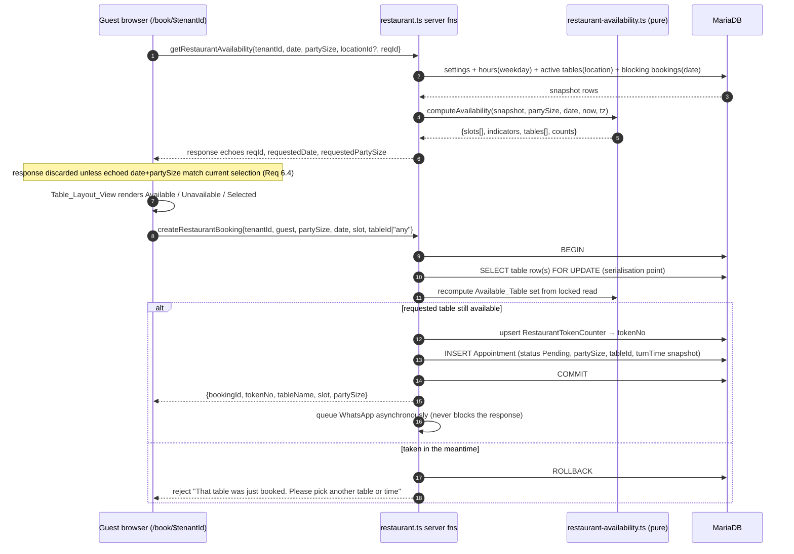
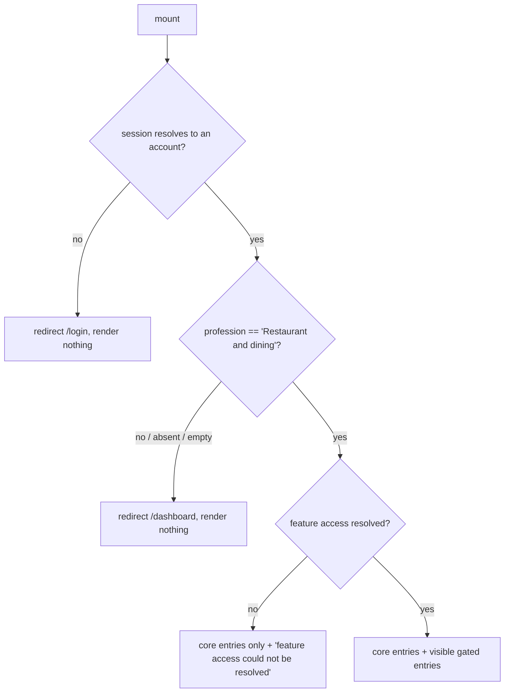

# Design Document

## Overview

This feature adds **Restaurant & Dining** as the sixth business category of BookMyTime. A restaurant owner signs up, lands on a dedicated dashboard at `/dashboards/restaurant`, registers dining tables with seat capacities and areas, configures operating hours and booking rules, and shares the existing public link `/book/$tenantId` — which now renders a party-size / date / slot / **visual table picker** flow instead of the doctor-and-slot flow.

Three constraints shape every decision below.

| Constraint | Consequence |
|---|---|
| The five existing categories must not change behaviour (Req 12) | Restaurant logic lives in **new modules and a new route**. The five 7k–12k line dashboard route files are not touched. `getClinicInfoAndSlotsServerFn` and `createAppointmentPublicServerFn` are not modified; the restaurant path gets its own server functions. Only three shared files get additive edits: `signup.tsx` (one dropdown option + one label rule), `auth.ts` (one `else if` for the `resto-` prefix + default settings insert), `dashboard.tsx` (one `else if` redirect). |
| Double booking must be impossible under concurrency (Req 7.8, 7.11) | Booking creation runs inside a **single SQL transaction** that locks the target `RestaurantTable` row, re-evaluates availability against that lock, allocates the `Booking_Token` from a per-tenant-per-date counter row, and inserts — commit or nothing. `src/lib/db.ts` gains a `withTransaction` helper, which the codebase currently lacks. |
| Availability must be deterministic and testable (Req 5.13) | All time and set arithmetic — slot generation, the half-open overlap test, capacity filtering, auto-assignment, ordering, occupancy rate — lives in a **pure, I/O-free, isomorphic module** (`src/lib/restaurant-availability.ts`) that takes a data snapshot plus an injected `now` and returns a value. The server layer only fetches rows and calls it. That module is the target of the property-based suite, exactly as `video-consultation.ts` is for the video feature. |

### Goals

- Additive-only schema: three new tables (`RestaurantTable`, `RestaurantSettings`, `RestaurantHours`), one new counter table (`RestaurantTokenCounter`), four new nullable columns on `Appointment`. No column is dropped, retyped, or made stricter.
- Bookings reuse `Appointment` and guests reuse `Patient`, so the existing Bookings List / WhatsApp / reminder plumbing keeps working, and Req 12.2 (empty table reference and party size for non-restaurant tenants) is satisfied by leaving the new columns `NULL`.
- One `Table_Layout_View` component consumed by both the public form and the dashboard, with an explicit accessibility contract (text label plus colour, state exposed to assistive technology).
- Availability computed from a snapshot so two identical requests return identical results.

### Non-Goals

- Joining multiple tables into one booking, floor-plan coordinates or drag-and-drop, menus, pre-orders, deposits (declared out of scope in the requirements).
- Any change to how the other five categories compute slots, store bookings, or resolve features.
- Real-time push. Availability is fetched on demand, as everywhere else in this app.

## Architecture

### Module map

```
              ┌───────────────────────────────────────────────────────────────┐
              │ src/lib/restaurant-availability.ts        (PURE, isomorphic)  │
              │ slot generation (Open→Close−Turn) · half-open overlap test    │
              │ Available_Table computation · auto-assignment · table order   │
              │ occupancy rate · phone normalisation · validation of table    │
              │ input, Operating_Hours and Service_Settings · slot ↔ minutes  │
              └───────────┬───────────────────────────────────┬───────────────┘
                          │ pure calls                        │ pure calls
        ┌─────────────────▼──────────────────┐   ┌────────────▼──────────────────┐
        │ src/lib/restaurant.ts              │   │ src/components/restaurant/*   │
        │ createServerFn boundary:           │   │ TableLayoutView.tsx (shared)  │
        │  availability · create booking     │   │ TableManager · BookingRules   │
        │  table CRUD · settings · hours     │   │ OperatingHours · WalkInDrawer  │
        │  bookings list · guests · overview │   └───────┬───────────────┬───────┘
        └───────┬──────────────────┬─────────┘           │               │
                │                  │             ┌───────▼──────┐ ┌──────▼────────────┐
      ┌─────────▼────────┐  ┌──────▼──────────┐  │ routes/      │ │ routes/dashboards/│
      │ restaurant.server│  │ feature-access  │  │ book.$tenant │ │ restaurant.tsx    │
      │ .ts  row access, │  │ .ts (+2 feature │  │ Id.tsx       │ │ (new route)       │
      │ FOR UPDATE locks,│  │  ids, no        │  │ (+ isResto   │ └───────────────────┘
      │ token counter    │  │  profession     │  │  branch)     │
      └────────┬─────────┘  │  input)         │  └──────────────┘
               │            └─────────────────┘
      ┌────────▼─────────────────────┐   ┌──────────────────────────────┐
      │ src/lib/db.ts                │   │ src/lib/whatsapp.ts enqueueWA│
      │ + withTransaction(fn)  (new) │   │ (unchanged, fire-and-forget) │
      └──────────────────────────────┘   └──────────────────────────────┘
```

Nothing in `restaurant-availability.ts` imports `db`, `crypto`, `auth`, or React. That is what makes the correctness properties runnable in milliseconds at 100+ iterations.

### Request flow — public booking



### Concurrency and atomicity

The double-booking guard is a **row lock on the `RestaurantTable` row**, not on the conflicting bookings. Conflicting `Appointment` rows may not exist yet at the moment of the check, so locking them cannot serialise two inserts; locking the table being booked can, because both transactions must take the same lock.

Lock order inside `createRestaurantBooking` / `reassignBooking` / `createWalkIn` is fixed and identical everywhere, which is what keeps deadlocks off the table:

1. `SELECT id, name, seatCapacity, area, displayOrder, state, locationId FROM RestaurantTable WHERE tenantId = ? AND id IN (...) ORDER BY id FOR UPDATE`
   — for an explicit table this is one row; for `Any available table` it is the tenant's candidate rows in `ORDER BY id`, so any two concurrent auto-assign transactions acquire locks in the same sequence.
2. Read the blocking bookings for the date **inside** the transaction and recompute the Available_Table set with the same pure function the availability endpoint used.
3. `INSERT INTO RestaurantTokenCounter (tenantId, bookingDate, lastToken) VALUES (?, ?, <seed>) ON DUPLICATE KEY UPDATE lastToken = lastToken + 1`, then read `lastToken` back. `<seed>` is `COALESCE(MAX(tokenNo), 0) + 1` over that tenant and date, so a tenant that already has bookings (or a legacy clinic-era row) continues the sequence rather than restarting it. The unique key `(tenantId, bookingDate)` makes the increment atomic, which gives per-tenant-per-date token uniqueness without a `MAX()` race.
4. `INSERT INTO Appointment ...`.
5. `COMMIT`.

The `withTransaction` helper added to `db.ts` mirrors the existing `query` / `execute` shape: acquire one pooled connection, `beginTransaction()`, run the callback with that connection, `commit()`, and on any throw `rollback()` — always releasing the connection in `finally`. Every statement in a transactional flow goes through the passed connection; mixing in a pool-level `query()` would run outside the transaction and is treated as a review error.

The re-check in step 2 must be a **locking read** (`FOR UPDATE`), not a plain read. Taking the `FOR UPDATE` lock on the `RestaurantTable` row is necessary but not sufficient: at `REPEATABLE READ` a transaction answers plain reads from the consistent snapshot it opened at its first statement, and for the transaction that had to wait on the row lock that snapshot predates the winner's `COMMIT`. The loser would therefore re-check availability against a state in which the winner's `Appointment` row does not exist yet and would insert a second booking on the same table. A locking read is exempt from the snapshot and always sees the latest committed version. The same applies to the `Booking_Token` seed read (`MAX(tokenNo)`) and the guest-number read (`MAX(patientNo)`), whose staleness would likewise change a decision. Reads issued on a pooled connection outside any transaction deliberately stay non-locking — a shared reader there would block writers for the life of the statement, and the read-only endpoints have nothing to serialise.

The three booking write transactions (`createBookingAtomic`, `reassignBookingAtomic`, `setBookingStatus`) run at `READ COMMITTED`, set for that transaction only so a pooled connection cannot leak the level to the next borrower. The reason is the lock **footprint**, not visibility. The availability re-check and the token seed read resolve through a tenant-only index (`Appointment_tenantId_idx`), i.e. a range over the whole tenant, so at `REPEATABLE READ` a locking read there takes next-key/gap locks covering the empty stretch where every concurrent booking of that tenant must insert. Two bookings on different tables share no lock at step 1, so both reach step 2, both take that same gap, and each one's `INSERT` then waits on the other's — `ER_LOCK_DEADLOCK`. `READ COMMITTED` drops the gap locks for these reads while `FOR UPDATE` keeps the freshness. The correctness argument still rests on the table lock plus the re-check under it, never on snapshot semantics.

One contention point the table lock cannot serialise remains: the `RestaurantTokenCounter` row of step 3, which every booking of a tenant and date must touch. When that row does not yet exist, three or more concurrent `INSERT ... ON DUPLICATE KEY UPDATE` statements on the same key queue on a shared lock for the duplicate check and then each need it exclusively, and InnoDB rolls one of them back. This is pre-existing rather than caused by the locking reads — the plain-read version deadlocks there too, just less often. It is handled by a bounded, jittered restart of the whole transaction: a deadlock victim is rolled back entirely, so no `Appointment` row, `Booking_Token` or guest record survives, and re-running the callback on a fresh transaction is equivalent to having arrived slightly later. Attempts are capped; after the last one the error propagates rather than looping.

### Timezone handling

The codebase has no tenant timezone anywhere today; it relies on server-local time. `Tenant_Timezone` is introduced as a `timezone` column on `RestaurantSettings`, defaulting to `Asia/Kolkata`, and it is used in exactly one place: converting "now" into a **tenant-local date string (`YYYY-MM-DD`) and minute-of-day** before the pure layer runs. From there on, all arithmetic in `restaurant-availability.ts` is on integers (minutes since midnight) and date strings — never on `Date` objects with implicit zones. Slot start times are persisted as `Appointment.dateTime` (wall time on the booking date, matching how every existing category stores appointments) plus the human label in `timeSlot`.

This keeps the timezone-dependent surface to one small, separately testable conversion (`tenantNow(tz, instant) → {dateStr, minutesOfDay, weekday}`) and keeps the availability core deterministic and zone-free.

### Feature gating

`feature-access.ts` stays pure and gains two feature ids, `restaurant_config` and `restaurant_bookings`, with entries in `PLAN_FEATURES` for all three tiers set to `true` and **no** `PROFESSION_FEATURES` entry. Adding keys cannot change any existing feature's resolution (the resolver iterates `FEATURE_IDS` and each feature reads only its own maps), which is how Req 12.4 is preserved — profession remains an input to nothing except the `video` restriction that already existed.

| Feature id | admin | reception | doctor | location |
|---|---|---|---|---|
| `restaurant_config` (Restaurant Profile, Operating Hours, Tables, Booking Rules) | `operate` | `view_only` | `none` | `operate` |
| `restaurant_bookings` (status changes, reassignment, walk-ins) | `operate` | `operate` | `view_only` | `operate` |

Navigation entry mapping: `WhatsApp` and `WhatsApp Alerts` → `whatsapp`, `Manage Plans` → `plans`, `Multi Location` → `locations`, `Manage Users` → `users`. Core entries (`Overview`, `Calendar`, `Bookings List`, `Guests`, `Settings`) are never gated. Every write server function re-checks permission server-side with `canOperateFeature`; hiding a control is a UI convenience, never the enforcement point (Req 2.8, 4.11, 9.13).

## Components and Interfaces

### `src/lib/restaurant-availability.ts` (pure)

```ts
export const PROFESSION_RESTAURANT = "Restaurant and dining";
export const TENANT_PREFIX_RESTAURANT = "resto-";

export const BLOCKING_STATUSES = ["Pending", "Confirmed", "Seated", "Completed"] as const;
export const RELEASING_STATUSES = ["Cancelled", "No Show"] as const;
export const BOOKING_STATUSES = [...BLOCKING_STATUSES, ...RELEASING_STATUSES] as const;

export const SLOT_INTERVALS = [15, 30, 60] as const;
export const DEFAULT_SETTINGS: ServiceSettings = {
  slotInterval: 30, turnTime: 90, maxPartySize: 12,
  advanceBookingWindow: 60, minLeadTime: 30, timezone: "Asia/Kolkata",
};
export const LIMITS = {
  tableName: { min: 1, max: 40 }, tableArea: { min: 1, max: 30 },
  seatCapacity: { min: 1, max: 30 }, displayOrder: { min: 1, max: 999 },
  tablesPerTenant: 200, guestName: { min: 1, max: 100 }, phoneDigits: { min: 7, max: 15 },
  turnTime: { min: 30, max: 240 }, maxPartySize: { min: 1, max: 30 },
  advanceBookingWindow: { min: 1, max: 365 }, minLeadTime: { min: 0, max: 1440 },
} as const;

// time helpers — integers only, no Date
export function parseClock(v: string): number | null;      // "18:30" -> 1110, rejects out of range
export function formatClock(minutes: number): string;      // 1110 -> "18:30"
export function formatSlotLabel(minutes: number): string;   // 1110 -> "06:30 PM"
export function parseSlotLabel(label: string): number | null;

// Req 5.2, 5.3
export function generateSlotStarts(hours: DayHours, s: ServiceSettings): number[];

// Req 5.5 — half-open [start, start+turn) intersection
export function windowsOverlap(aStart: number, aTurn: number, bStart: number, bTurn: number): boolean;

// Req 5.1–5.14
export function computeAvailability(input: AvailabilityInput): AvailabilityResult;

// Req 7.3
export function pickAutoTable(candidates: DiningTable[]): DiningTable | null;

// Req 3.14
export function orderTables(tables: DiningTable[]): DiningTable[];

// Req 9.10, 9.11
export function occupancyRate(blockingPairs: number, activeTables: number, slotCount: number): number;

// Req 10.5
export function normalisePhone(raw: string): string;

// validation — return { ok: true, value } | { ok: false, errors: FieldError[] }
export function validateTableInput(i: TableInput, ctx: TableContext): Result<NormalisedTable>;
export function validateServiceSettings(i: unknown): Result<ServiceSettings>;
export function validateOperatingHours(i: unknown): Result<DayHours[]>;   // all 7 days, all-or-nothing
export function validateBookingRequest(i: BookingInput, ctx: BookingContext): Result<NormalisedBooking>;

// timezone edge — the only zone-aware function
export function tenantNow(timezone: string, instant: Date): { dateStr: string; minutesOfDay: number; weekday: number };
```

`computeAvailability` contract:

```ts
interface AvailabilityInput {
  settings: ServiceSettings;          // stored values, per-field defaults already applied (Req 4.9)
  hours: DayHours;                    // the weekday row for `date`, or a default-closed row
  tables: DiningTable[];              // active + inactive, already location-scoped
  bookings: ExistingBooking[];        // blocking-status bookings on `date` for those tables
  partySize: number;
  date: string;                       // YYYY-MM-DD
  nowDateStr: string;                 // tenant-local today
  nowMinutes: number;                 // tenant-local minute of day
  daysAhead: number;                  // whole days from nowDateStr to date
}

interface AvailabilityResult {
  closed: boolean;                    // Req 5.4
  outOfWindow: boolean;               // Req 5.9 — suppresses every other indicator (Req 5.11)
  capacityExceeded: boolean;          // Req 5.10
  activeTableCount: number;           // Req 5.12
  largestCapacity: number;
  slots: Array<{
    startMinutes: number;
    label: string;
    availableTableIds: string[];      // ordered by orderTables
    availableCount: number;           // Req 5.12
    occupiedCount: number;            // Req 9.8
  }>;
}
```

Indicator precedence is explicit and total: `outOfWindow` short-circuits and returns empty slots with `closed` and `capacityExceeded` both false (Req 5.11); otherwise `closed` returns empty slots; otherwise slots are generated and `capacityExceeded` is set when `partySize > largestCapacity` while every `availableTableIds` is `[]` (Req 5.10).

### `src/lib/restaurant.server.ts` (row access)

Thin, tenant-scoped SQL. Every function takes `tenantId` as its first argument and every statement contains `tenantId = ?`; none accepts a table or booking id without also constraining `tenantId`, which is how Req 11.1–11.3 is enforced structurally rather than by discipline.

```ts
getSettings(tenantId): Promise<StoredSettings | null>;
upsertSettings(tenantId, s: ServiceSettings): Promise<void>;
getHours(tenantId): Promise<StoredHours[]>;                       // 0..7 rows
replaceHours(tenantId, days: DayHours[]): Promise<void>;          // all 7, single transaction
listTables(tenantId, opts?: { locationId?: string | null; includeInactive?: boolean }): Promise<DiningTable[]>;
countTables(tenantId): Promise<number>;
findTableByName(tenantId, name, exceptId?): Promise<DiningTable | null>;
insertTable / updateTable / setTableState / deleteTable(tenantId, ...);
hasUpcomingBlockingBookings(tenantId, tableId, nowIso): Promise<boolean>;
listBlockingBookings(tenantId, date, tableIds): Promise<ExistingBooking[]>;
createBookingAtomic(tenantId, req): Promise<CreateResult>;        // withTransaction, see Architecture
reassignBookingAtomic(tenantId, bookingId, targetTableId): Promise<ReassignResult>;
listBookings(tenantId, filters, page): Promise<{ rows: BookingRow[]; total: number }>;
setBookingStatus(tenantId, bookingId, status): Promise<void>;
linkOrCreateGuest(conn, tenantId, name, phone): Promise<string>;  // Patient row, Req 10.1–10.4
```

### `src/lib/restaurant.ts` (server function boundary)

| Server function | Method | Auth | Requirements |
|---|---|---|---|
| `getRestaurantAvailabilityServerFn` | GET | public, `tenantId` from URL | 5.1–5.14, 6.4 |
| `createRestaurantBookingPublicServerFn` | POST | public | 7.1–7.12, 8.x, 10.1–10.6 |
| `getRestaurantTablesServerFn` / `saveRestaurantTableServerFn` / `setRestaurantTableStateServerFn` / `deleteRestaurantTableServerFn` | GET/POST | session, `restaurant_config` | 3.1–3.18, 11.1–11.5 |
| `getRestaurantRulesServerFn` / `saveRestaurantHoursServerFn` / `saveRestaurantSettingsServerFn` | GET/POST | session, `restaurant_config` = `operate` | 4.1–4.13 |
| `getRestaurantBookingsServerFn` | GET | session, `restaurant_bookings` | 9.1–9.3, 9.12 |
| `setRestaurantBookingStatusServerFn` / `reassignRestaurantBookingServerFn` / `createWalkInBookingServerFn` | POST | session, `restaurant_bookings` = `operate` | 9.4–9.7, 9.13 |
| `getRestaurantOverviewServerFn` | GET | session | 9.8–9.11 |
| `getRestaurantGuestsServerFn` | GET | session | 10.3 |

Every handler follows the same four steps: `verifySession()` (public ones skip it and take `tenantId` from the validated payload) → permission check via `canOperateFeature` / `canUseFeature` → pure validation → row access. Public handlers additionally verify that the addressed tenant's profession is `Restaurant and dining` before doing anything restaurant-shaped.

### `src/components/restaurant/TableLayoutView.tsx` (shared)

One component, two consumers: the public booking form (interactive selection) and the dashboard `Tables` sub-tab (read-only registry view, Req 3.15).

```ts
interface TableLayoutViewProps {
  tables: LayoutTable[];                        // already ordered by orderTables
  stateOf: (t: LayoutTable) => AvailabilityState;   // "Available" | "Unavailable" | "Selected"
  onActivate?: (t: LayoutTable) => void;
  mode: "select" | "registry";
  message?: string | null;                      // rendered into the live region
}
```

Accessibility contract (Req 6.9, and Req 3.15 for the registry mode) — these are assertions the component tests hold to, not styling suggestions:

- Each area is a `<section role="group">` with an `aria-labelledby` pointing at the visible area heading; tables are `<button type="button">` children.
- The button's accessible name is composed text: `` `${name}, seats ${seatCapacity}, ${stateLabel}` ``. State is therefore in the accessible name, not only in a class.
- A **visible text label** for the state renders inside every card (`Available` / `Booked` / `Selected` in select mode; `Active` / `Inactive` in registry mode). Colour is an additional channel, never the only one.
- `Selected` sets `aria-pressed="true"`; `Available` sets `aria-pressed="false"`; `Unavailable` sets `aria-disabled="true"` and keeps `aria-pressed="false"`.
- Unavailable buttons use `aria-disabled`, **not** the `disabled` attribute, so they stay focusable and can still fire `onActivate` — which is what makes Req 6.8 (activate an unavailable table → keep current selection, show `This table is already booked for the selected time`) reachable by keyboard.
- `message` renders in an `aria-live="polite"` region that also announces selection changes, so a screen-reader user learns the outcome of activating a table.
- Registry mode renders no `onActivate` affordance and no create/edit/delete controls when the caller's permission is `view_only` (Req 2.8).

### `src/routes/dashboards/restaurant.tsx` (new route)

Structure mirrors the five existing category dashboards — same shell, same `activeTab` state persisted to `localStorage` under `bmt_active_tab`, same mobile bottom bar — but composes extracted components instead of inlining thousands of lines.

Guard order on mount, evaluated before any dashboard content renders (Req 2.2, 2.3):



Tabs: `Overview` · `Calendar` · `Bookings List` · `Guests` · `WhatsApp`* · `Settings` · `Manage Plans`* (`*` = gated). Settings sub-tabs: `Restaurant Profile` · `Operating Hours` · `Tables` · `Booking Rules` (shown when `restaurant_config` permission is `operate` or `view_only`; omitted entirely when `none`, Req 2.9) plus the gated `WhatsApp Alerts` · `Multi Location` · `Manage Users`. Requesting a non-visible gated tab falls back to rendering `Overview` (Req 2.11).

### `src/routes/book.$tenantId.tsx` (additive branch)

`const isRestaurant = profession === "Restaurant and dining" || tenantId.startsWith("resto-")` joins the existing `isGym` / `isEducation` / `isBeauty` / `isProfessional` flags. When true, the component renders the restaurant field set (Guest name, Phone, Email, Party size, Date, Slot, Table selection defaulting to `Any available table`, Special requests) and calls the new server functions. When false, every existing code path runs byte-for-byte as before — the restaurant branch is an added arm, not a rewrite of the shared arms.

Stale-response discipline (Req 6.4): each availability request carries an incrementing `reqId` and the response echoes `requestedDate` and `requestedPartySize`; a response is applied only when both echoes equal the current selection and `reqId` is the latest issued. Changing party size or date clears the table selection back to `Any available table` **before** the new response is applied (Req 6.13).

## Data Models

All DDL follows the established `db.ts` pattern: `CREATE TABLE IF NOT EXISTS` in its own `try/catch`, then idempotent `ALTER TABLE ... ADD COLUMN` guarded by `SHOW COLUMNS` or a swallowed catch. Charset/collation match the surrounding tables (`utf8mb4` / `utf8mb4_unicode_ci`), which also gives case-insensitive uniqueness for free.

### `RestaurantTable`

```sql
CREATE TABLE IF NOT EXISTS RestaurantTable (
  id            VARCHAR(255) PRIMARY KEY,
  tenantId      VARCHAR(255) NOT NULL,
  locationId    VARCHAR(255) NULL,             -- NULL = Primary_Location (Req 11.4, 11.5)
  name          VARCHAR(40)  NOT NULL,
  seatCapacity  INT          NOT NULL,
  area          VARCHAR(30)  NOT NULL DEFAULT 'Main',
  displayOrder  INT          NOT NULL DEFAULT 1,
  state         VARCHAR(16)  NOT NULL DEFAULT 'active',   -- active | inactive
  createdAt     TIMESTAMP DEFAULT CURRENT_TIMESTAMP,
  updatedAt     TIMESTAMP DEFAULT CURRENT_TIMESTAMP ON UPDATE CURRENT_TIMESTAMP,
  UNIQUE KEY uq_resto_table_name (tenantId, name),        -- CI via collation (Req 3.3)
  KEY idx_resto_table_tenant (tenantId, state),
  KEY idx_resto_table_loc (tenantId, locationId)
);
```

`Primary_Location` is represented as `locationId IS NULL`, matching the existing `Appointment.locationId` convention where the main branch stores `NULL` and the UI uses the `__main__` sentinel. Name uniqueness is per **tenant**, not per location, as Req 3.3 states.

### `RestaurantSettings`

```sql
CREATE TABLE IF NOT EXISTS RestaurantSettings (
  id                   VARCHAR(255) PRIMARY KEY,
  tenantId             VARCHAR(255) NOT NULL UNIQUE,
  slotInterval         INT NOT NULL DEFAULT 30,
  turnTime             INT NOT NULL DEFAULT 90,
  maxPartySize         INT NOT NULL DEFAULT 12,
  advanceBookingWindow INT NOT NULL DEFAULT 60,
  minLeadTime          INT NOT NULL DEFAULT 30,
  timezone             VARCHAR(64) NOT NULL DEFAULT 'Asia/Kolkata',
  createdAt            TIMESTAMP DEFAULT CURRENT_TIMESTAMP,
  updatedAt            TIMESTAMP DEFAULT CURRENT_TIMESTAMP ON UPDATE CURRENT_TIMESTAMP
);
```

Column defaults carry the Req 1.5 / 4.3–4.7 defaults, and the pure layer applies the same defaults per field when a row or value is missing (Req 4.9), so a tenant whose settings insert failed still gets correct availability.

### `RestaurantHours`

```sql
CREATE TABLE IF NOT EXISTS RestaurantHours (
  id        VARCHAR(255) PRIMARY KEY,
  tenantId  VARCHAR(255) NOT NULL,
  dayOfWeek INT NOT NULL,                -- 0 = Sunday, matching ClinicHours
  openTime  VARCHAR(5) NOT NULL,         -- "HH:MM"
  closeTime VARCHAR(5) NOT NULL,
  isClosed  TINYINT(1) NOT NULL DEFAULT 0,
  createdAt TIMESTAMP DEFAULT CURRENT_TIMESTAMP,
  updatedAt TIMESTAMP DEFAULT CURRENT_TIMESTAMP ON UPDATE CURRENT_TIMESTAMP,
  UNIQUE KEY uq_resto_hours (tenantId, dayOfWeek)
);
```

Deliberately **separate from `ClinicHours`** rather than reusing it. `ClinicHours` feeds the existing gym and education slot generation inside `getClinicInfoAndSlotsServerFn`; writing restaurant hours into it would make Req 12.1 (no `Operating_Hours` input to non-restaurant availability) impossible to guarantee, and would couple two independently evolving semantics (`ClinicHours` has no turn time and treats a missing row as "closed at weekends").

### `RestaurantTokenCounter`

```sql
CREATE TABLE IF NOT EXISTS RestaurantTokenCounter (
  tenantId    VARCHAR(255) NOT NULL,
  bookingDate DATE NOT NULL,
  lastToken   INT NOT NULL DEFAULT 0,
  PRIMARY KEY (tenantId, bookingDate)
);
```

The primary key is the concurrency guarantee: `INSERT ... ON DUPLICATE KEY UPDATE lastToken = lastToken + 1` is a single atomic statement, so two concurrent bookings on the same tenant and date cannot read the same `lastToken` (Req 7.2).

### `Appointment` — four added nullable columns

```sql
ALTER TABLE Appointment ADD COLUMN tableId          VARCHAR(255) NULL;
ALTER TABLE Appointment ADD COLUMN partySize        INT          NULL;
ALTER TABLE Appointment ADD COLUMN turnTimeMinutes  INT          NULL;
ALTER TABLE Appointment ADD COLUMN tableNameAtBooking VARCHAR(40) NULL;
ALTER TABLE Appointment ADD INDEX idx_apt_table_window (tenantId, tableId, dateTime);
```

- `turnTimeMinutes` is the **Turn_Time snapshot** taken at creation (Req 7.1). Availability compares each existing booking's own snapshot against the candidate window, so changing Turn_Time later cannot retroactively move an existing occupancy and cannot invalidate stored bookings (Req 4.12).
- `tableNameAtBooking` is why a deleted table's bookings still show the name they were booked against (Req 3.12).
- All four stay `NULL` for the five existing categories, which is exactly Req 12.2.

Field mapping for a restaurant booking onto the existing row shape: `name`/`phone`/`email` = guest contact, `dateTime` = booking date + slot start, `timeSlot` = slot label (`"07:30 PM"`), `reason` = special requests (`''` when blank, the column is `NOT NULL`), `status` ∈ the six `Booking_Status` values, `tokenNo` = `Booking_Token`, `patientId` = linked `Patient` (Guest) row, `locationId` = branch or `NULL`, `doctorId` = `NULL`.

### Guests

Guest records reuse `Patient` (`tenantId`, `patientNo` sequential per tenant, `name`, `phone`), so the `Guests` tab is a relabelled read over an existing tenant-scoped registry with its `UNIQUE KEY tenant_patno` already in place. Matching is by `Normalised_Phone` computed in the pure layer and compared against normalised stored values; the guest link is created inside the booking transaction (Req 10.1, 10.2). A booking whose guest name differs from the stored guest name keeps its own `Appointment.name` and leaves the `Patient.name` untouched (Req 10.6).

### Status vocabulary

`Appointment.status` is already `VARCHAR(50)` with no CHECK constraint, so `Seated` and `No Show` need no migration. Blocking vs releasing is decided in one place (`BLOCKING_STATUSES` in the pure module) and every SQL predicate is generated from that constant rather than hand-written per query, so the two sets cannot drift.

## Correctness Properties

*A property is a characteristic or behavior that should hold true across all valid executions of a system — essentially, a formal statement about what the system should do. Properties serve as the bridge between human-readable specifications and machine-verifiable correctness guarantees.*

All properties below target `src/lib/restaurant-availability.ts` and the in-memory model of the booking transaction, both of which are pure and therefore cheap to run at 100+ iterations.

### Property 1: Slot generation is bounded by Close_Time minus Turn_Time

*For any* weekday hours and any Service_Settings, the generated Booking_Slot list either is empty — exactly when the day is closed or when Close_Time minus Turn_Time is earlier than Open_Time — or starts at Open_Time, has a constant difference of Slot_Interval between consecutive starts, has every start at or before Close_Time minus Turn_Time, and admits no further start within that bound. A closed weekday produces the same empty result whatever Open_Time and Close_Time it stores.

**Validates: Requirements 4.13, 5.2, 5.3, 5.4**

### Property 2: Clock values round-trip through their string form

*For any* whole minute of day from 0 to 1439, formatting it as a clock string and parsing that string returns the same minute; and *for any* string that is not a whole-minute time from 00:00 to 23:59, parsing rejects it.

**Validates: Requirements 4.1**

### Property 3: Occupancy windows overlap exactly when their half-open intervals intersect

*For any* two Occupancy_Windows described by a start minute and a Turn_Time, the overlap test is true if and only if the first start is earlier than the second end and the second start is earlier than the first end; in particular, *for any* window, a candidate whose start equals that window's end does not overlap it.

**Validates: Requirements 5.5**

### Property 4: No two blocking bookings share a table and an overlapping window

*For any* sequence of booking creations, table reassignments, and Booking_Status changes applied to a Restaurant_Tenant, after every step no two Table_Bookings in a Blocking_Status reference the same Dining_Table with overlapping Occupancy_Windows; and *for any* pair of requests naming the same Dining_Table with overlapping Occupancy_Windows submitted concurrently, exactly one is accepted and the other is rejected with `That table was just booked. Please pick another table or time`.

**Validates: Requirements 7.4, 7.8, 7.11, 9.6**

### Property 5: The Available_Table set equals its reference definition, and the reported counts agree with it

*For any* snapshot of Dining_Tables, existing Table_Bookings, Service_Settings, and Party_Size, the Available_Table set the Availability_Service returns for each Booking_Slot equals, element for element, the set of Dining_Tables whose Table_State is `active` and none of whose blocking Table_Bookings overlaps that Booking_Slot's Occupancy_Window — independent of Seat_Capacity, and including when the booked Dining_Table is `inactive`, in which case it is excluded from availability while its blocking Table_Booking still occupies its window. For each Booking_Slot the reported available count equals the size of that set, the reported available capacity equals the summed Seat_Capacity of that set, the reported active-table count equals the number of `active` Dining_Tables, and available plus occupied never exceeds the active-table count.

**Validates: Requirements 3.10, 3.13, 5.1, 5.6, 5.12, 9.8**

### Property 6: Same-day slots respect Min_Lead_Time

*For any* current time, any Min_Lead_Time from 0 to 1440, and any weekday hours, every Booking_Slot returned for the current date has a start time at or after the current time plus Min_Lead_Time, and every generated start time earlier than that bound is absent from the returned list.

**Validates: Requirements 5.7, 5.8**

### Property 7: At most one availability indicator is raised, and out-of-window wins

*For any* snapshot, at most one of the closed, out-of-window, and multiple-tables indicators is true; out-of-window is true exactly when the booking date is later than the current date plus Advance_Booking_Window days and then the Booking_Slot list is empty and the other two indicators are false; the multiple-tables indicator is true exactly when the date is in window, the day is open, at least one `active` Dining_Table exists, and the requested Party_Size exceeds the largest Seat_Capacity among them — and when it is true the Booking_Slot list is non-empty and every Available_Table set is unchanged by it, because a Table_Group can seat the party.

**Validates: Requirements 5.9, 5.10, 5.11**

### Property 8: Availability is deterministic and order-independent

*For any* snapshot, computing availability twice returns deeply equal results, and permuting the order of the Dining_Table and Table_Booking inputs leaves the result deeply equal — so two requests for the same Tenant, date, and Party_Size with no intervening change return identical Booking_Slots and identical Available_Table sets, and no result depends on a value from an earlier call.

**Validates: Requirements 4.10, 5.13**

### Property 9: Tenant-local now is derived from the Tenant_Timezone

*For any* instant and any Tenant_Timezone, the derived current date, current minute of day, and weekday agree with that instant rendered in that timezone, and the derived values change with the timezone whenever the timezone's local date or clock differs for that instant.

**Validates: Requirements 5.14**

### Property 10: Booking_Tokens are unique and sequential per Tenant per date

*For any* sequence of accepted Table_Bookings across arbitrary Tenants and dates, including concurrently submitted ones, the Booking_Tokens within a single Tenant and calendar date are pairwise distinct, the first is 1 greater than the largest Booking_Token already assigned for that Tenant and date, and each subsequent one is exactly 1 greater than its predecessor; a rejected request leaves the sequence for that Tenant and date unchanged.

**Validates: Requirements 7.2**

### Property 11: Auto-assignment picks the smallest sufficient table, or the fewest tables that seat the party, deterministically

*For any* Available_Table set, the Table_Group assigned for the Table selection `Any available table` holds only members of that set, is invariant to the order in which the set is supplied, and is empty exactly when the set is empty. Where at least one member seats the Party_Size, the Table_Group is exactly one such member and no sufficient member has a smaller Seat_Capacity. Where no member seats the Party_Size, the Table_Group is built largest-Seat_Capacity first until its summed Seat_Capacity reaches the Party_Size, or is the whole set when even that is insufficient — so Seat_Capacity never refuses an assignment. Ties are resolved by the lowest Display_Order and then the lowest Table_Name in ascending order.

**Validates: Requirements 7.3**

### Property 12: An accepted booking round-trips into its record and its response

*For any* valid restaurant booking request, the created Table_Booking holds the submitted `tenantId`, Guest name, Guest phone, Guest email, Party_Size, booking date-time, Booking_Slot, and assigned Dining_Table, holds the Turn_Time in force at creation, holds Booking_Status `Pending`, holds a Booking_Token, and the returned response reports the booking identifier, the Booking_Token, the assigned Table_Name, the Booking_Slot, and the Party_Size matching that record.

**Validates: Requirements 7.1, 7.9, 7.10**

### Property 13: Every rejected booking leaves the stored bookings unchanged

*For any* booking request whose Table_Group holds a Dining_Table that is not available, whose Party_Size falls outside 1 through Max_Party_Size, whose Booking_Slot is absent from the Booking_Slots computed for the date, whose Guest name has a trimmed length of 0 or greater than 100 characters, or whose Normalised_Phone holds fewer than 7 or more than 15 digits, the request is rejected with the message stated for that condition and the set of stored Table_Bookings is unchanged; and *for any* accepted request, none of those conditions holds. Seat_Capacity is deliberately absent from this list: no relationship between the summed Seat_Capacity of the Table_Group and the Party_Size can reject a request.

**Validates: Requirements 7.4, 7.5, 7.6, 7.7, 7.12**

### Property 14: Releasing a booking restores the availability that preceded it

*For any* snapshot and any accepted Table_Booking, computing availability after that Table_Booking's Booking_Status is set to a Releasing_Status returns a result deeply equal to the availability computed before that Table_Booking existed.

**Validates: Requirements 9.4, 9.5**

### Property 15: Walk-in creation is equivalent to public creation, plus the Seated status

*For any* booking input, the walk-in path accepts it if and only if the Public_Booking_Form path accepts it and rejects it with the same message otherwise; every Table_Booking the walk-in path creates carries Booking_Status `Seated`.

**Validates: Requirements 9.7**

### Property 16: Configuration changes never mutate existing bookings

*For any* set of existing Table_Bookings and any valid change to Operating_Hours, to Service_Settings, to a Dining_Table's fields, or to a Dining_Table's Table_State, the stored Table_Bookings are unchanged afterwards — identifiers, assigned Dining_Table, Booking_Status, and Turn_Time snapshot included — including Table_Bookings whose Booking_Slot now falls outside the saved Operating_Hours; and *for any* Table_Booking, the Table_Name it displays equals the Table_Name recorded at booking time whether or not that Dining_Table still exists.

**Validates: Requirements 3.8, 3.9, 3.12, 4.12**

### Property 17: Dining_Table input is accepted exactly within its documented limits

*For any* submitted Table_Name, Seat_Capacity, Table_Area, and Display_Order, the submission is accepted if and only if the trimmed Table_Name length is 1 through 40, the Seat_Capacity is a whole number 1 through 30, any supplied Table_Area trims to at most 30 characters, any supplied Display_Order is a whole number 1 through 999, and the Tenant holds fewer than 200 Dining_Tables across both Table_States; an accepted submission stores the trimmed Table_Name, stores the trimmed Table_Area or `Main` when it trims to empty, stores Table_State `active` on creation, and stores as Display_Order, when none is supplied, 1 greater than the highest Display_Order in that Table_Area or 1 when that Table_Area holds none; a rejected submission returns a message naming the offending field with its permitted range and leaves every stored Dining_Table unchanged.

**Validates: Requirements 3.1, 3.2, 3.4, 3.5, 3.6, 3.7, 3.16, 3.17, 3.18**

### Property 18: Duplicate Table_Name detection ignores case and surrounding whitespace

*For any* stored Table_Name and any variant of it produced by changing letter case or adding leading and trailing whitespace, submitting that variant for a different Dining_Table of the same Tenant is rejected with `A table with this name already exists` and leaves every stored Dining_Table unchanged, while submitting it for the Dining_Table that already holds that Table_Name is accepted.

**Validates: Requirements 3.3**

### Property 19: Dining_Table ordering is a canonical total order

*For any* set of Dining_Tables, the ordered read is a permutation of that set, is non-decreasing under Table_Area ascending then Display_Order ascending then Table_Name ascending with Table_Area and Table_Name compared case-insensitively, and is identical whatever order the input arrives in.

**Validates: Requirements 3.14, 3.15**

### Property 20: Deletion is refused exactly when an upcoming blocking booking references the table

*For any* Dining_Table and any set of Table_Bookings referencing it, deletion is refused with `This table has upcoming bookings. Set the table to inactive instead` if and only if some referencing Table_Booking has a Booking_Slot start time later than the current time and a Blocking_Status; a refusal leaves that Dining_Table and every referencing Table_Booking unchanged, and an accepted deletion retains every referencing Table_Booking.

**Validates: Requirements 3.11, 3.12**

### Property 21: Service_Settings and Operating_Hours are accepted exactly within their documented limits, and absent values fall back to defaults

*For any* submitted Service_Settings, the submission is accepted if and only if Slot_Interval is 15, 30, or 60, Turn_Time is a whole number 30 through 240, Max_Party_Size is a whole number 1 through 30, Advance_Booking_Window is a whole number 1 through 365, and Min_Lead_Time is a whole number 0 through 1440; *for any* submitted Operating_Hours, the submission is accepted if and only if every weekday whose Closed_Flag is false carries an Open_Time and a strictly later Close_Time; a rejected submission names every offending field or the offending weekday and leaves the previously stored Service_Settings and all seven stored Operating_Hours rows unchanged; and *for any* partially stored Service_Settings, each absent field resolves to its documented default while every present field is used as stored.

**Validates: Requirements 4.2, 4.3, 4.4, 4.5, 4.6, 4.7, 4.8, 4.9**

### Property 22: Guest linking is invariant to phone formatting

*For any* phone value, its Normalised_Phone contains no space, hyphen, opening bracket, or closing bracket, normalising it twice equals normalising it once, and inserting any number of those four characters anywhere in the value leaves its Normalised_Phone unchanged; *for any* sequence of Table_Bookings within one Tenant, two bookings link to the same Guest record if and only if their Normalised_Phone values are equal, a booking carrying no Guest phone links to a Guest record identified by its Guest name, Guest numbers within a Tenant are distinct and sequential, and a booking whose Guest name differs from the matched Guest record stores its own Guest name while leaving that Guest record's name unchanged.

**Validates: Requirements 10.1, 10.2, 10.4, 10.5, 10.6**

### Property 23: Booking and Guest projections, filters, ordering, and pagination are faithful

*For any* set of Table_Bookings and any combination of date-range, Booking_Status, Table_Area, Dining_Table, Guest-name, and Guest-phone criteria, the Bookings List contains exactly the Table_Bookings satisfying every supplied criterion, exposes for each one the Guest name, Guest phone, Party_Size, booking date, Booking_Slot, Table_Name, Booking_Status, and Booking_Token, is ordered by booking date descending then Booking_Slot start ascending then Booking_Token ascending, and splits into pages of 25 whose concatenation reproduces that order with no Table_Booking missing or repeated; and *for any* Guest record, the displayed booking count, most recent booking date, and `No Show` count equal those aggregates over the Table_Bookings linked to it.

**Validates: Requirements 9.1, 9.2, 9.3, 9.12, 10.3**

### Property 24: Overview aggregates are faithful and the occupancy rate stays bounded

*For any* set of Table_Bookings, the Overview booking count and Party_Size sum equal those aggregates over the Table_Bookings whose booking date is the current date in the Tenant_Timezone; *for any* blocking table-slot pair count, `active` Dining_Table count, and Booking_Slot count, the occupancy rate is a whole number between 0 and 100 inclusive, equals the ratio of blocking pairs to the product of the two counts rounded to the nearest whole number, is non-decreasing in the blocking pair count, and is 0 when the Booking_Slot count is 0.

**Validates: Requirements 9.9, 9.10, 9.11**

### Property 25: Tenant isolation holds for every read and every write

*For any* store holding Dining_Tables and Table_Bookings for several Tenants, every read performed for one Tenant returns only rows carrying that Tenant's `tenantId` and is unchanged by adding, altering, or removing rows belonging to any other Tenant; every operation naming a Dining_Table or Table_Booking of another Tenant is rejected as not found and mutates no row of either Tenant.

**Validates: Requirements 11.1, 11.2, 11.3**

### Property 26: Dining_Tables are scoped to exactly one Location and availability respects that scope

*For any* Dining_Table, it is associated with exactly one Location of its own Tenant, which is the Primary_Location whenever the multi-location feature is unavailable or no Location is supplied; *for any* multi-location Tenant and any selected Location, the Available_Table sets contain only Dining_Tables associated with that Location — the Primary_Location when none is selected — and are unchanged by adding Dining_Tables to any other Location.

**Validates: Requirements 11.4, 11.5, 11.6, 11.7**

### Property 27: Navigation is derived from the resolved feature access

*For any* account context, the Restaurant_Dashboard navigation contains all five Core_Navigation_Entries, contains a Gated_Navigation_Entry if and only if the Feature_Access_Service resolves it visible for that account, contains the `Restaurant Profile`, `Operating Hours`, `Tables`, and `Booking Rules` sub-tabs if and only if the resolved permission for restaurant configuration is `operate` or `view_only` — with create, edit, delete, and save controls present only for `operate` — and resolves the effective tab to the requested tab when that tab is visible and to `Overview` otherwise.

**Validates: Requirements 2.4, 2.5, 2.6, 2.7, 2.8, 2.9, 2.11**

### Property 28: Writes are refused server-side whenever the resolved permission is not operate

*For any* account context whose resolved permission for restaurant configuration is not `operate` and any submitted Dining_Table, Operating_Hours, or Service_Settings payload, and *for any* account context whose resolved permission for booking management is not `operate` and any submitted Booking_Status change or table reassignment, the submission is rejected with a not-authorised message and the stored Dining_Tables, Operating_Hours, Service_Settings, Booking_Statuses, and assigned Dining_Tables are unchanged.

**Validates: Requirements 2.8, 4.11, 9.13**

### Property 29: Dashboard routing and the restaurant guard are total functions of session and profession

*For any* profession value, including absent, empty, and unrecognised ones, `/dashboard` resolves to `/dashboards/restaurant` for `Restaurant and dining`, to `/dashboards/gym`, `/dashboards/beauty`, `/dashboards/professional`, and `/dashboards/education` for the four respective professions, and to `/dashboards/medical` otherwise; *for any* session and profession pair, a request for `/dashboards/restaurant` resolves to a `/login` redirect when the session resolves to no account, to a `/dashboard` redirect when it resolves to an account whose profession is not `Restaurant and dining`, and to rendering only in the remaining case.

**Validates: Requirements 2.1, 2.2, 2.3, 12.3, 12.5**

### Property 30: Restaurant data and the restaurant category change nothing for the existing categories

*For any* Tenant whose Business_Profession is not `Restaurant and dining`, the Booking_Slots computed for a given date and staff member are deeply equal whether or not arbitrary Operating_Hours, Service_Settings, and Dining_Table rows exist for that Tenant, and every booking created for that Tenant stores an empty Dining_Table reference, Party_Size, Turn_Time snapshot, and Table_Name snapshot; *for any* account context, the resolved feature availability and permission of every feature carrying no profession restriction are unchanged when only the Business_Profession varies.

**Validates: Requirements 12.1, 12.2, 12.4**

### Property 31: The Table_Layout_View exposes exactly one state per table, in text and to assistive technology

*For any* set of Dining_Tables and any Availability_State assignment, the Table_Layout_View renders each Dining_Table exactly once inside its Table_Area group in the canonical order, renders its Table_Name, its Seat_Capacity, and exactly one state as visible text alongside colour, gives it an accessible name containing the Table_Name, the Seat_Capacity, and that state, marks it pressed when and only when its state is `Selected`, and marks it disabled to assistive technology when and only when its state is `Unavailable` while keeping it focusable; a Dining_Table renders as `Selected` if and only if it is a member of the Table_Group, and as `Available` if and only if it is an Available_Table of the selected Booking_Slot that is not a member of the Table_Group.

**Validates: Requirements 3.15, 6.5, 6.6, 6.9**

### Property 32: Table selection holds at most one table and resets on every party-size or date change

*For any* sequence of table activations, at most one Dining_Table is `Selected` after every step and it is the most recently activated Available_Table; activating a Dining_Table whose state is `Unavailable` leaves the selection unchanged and displays `This table is already booked for the selected time`; and *for any* change of Party_Size or booking date, the Table selection is `Any available table` once the fresh availability is rendered, retaining no previously selected Dining_Table.

**Validates: Requirements 6.7, 6.8, 6.13**

### Property 33: Only the response matching the current selection is applied

*For any* interleaving of availability requests and out-of-order responses, the rendered Booking_Slots and Available_Table sets always correspond to the currently selected Party_Size and booking date, and no response whose requested Party_Size or requested booking date differs from the current selection is applied.

**Validates: Requirements 6.4**

### Property 34: Public form validation matches the offered option space

*For any* Max_Party_Size within its permitted range, the Party_Size control offers exactly the values 1 through Max_Party_Size; *for any* subset of Party_Size, booking date, and Booking_Slot left empty at submission, a field-level message is shown for exactly those fields and no booking request is sent; *for any* availability result, every Booking_Slot whose Available_Table count is 0 remains selectable and displays `No table free at this time`.

**Validates: Requirements 6.2, 6.10, 6.11**

### Property 35: Signup name validation, label selection, and tenant prefix are pure functions of their inputs

*For any* business name, the Signup_Form accepts it if and only if its trimmed length is 1 through 100 characters, and on rejection reports that the restaurant name must be between 1 and 100 characters while sending no signup request and retaining the entered values; *for any* sequence of Business_Profession selections, the business name field's label is `Restaurant Name` exactly while `Restaurant and dining` is selected and the entered text is unchanged by any selection change; *for any* Business_Profession, the assigned `tenantId` prefix is `resto-` for `Restaurant and dining` and its existing prefix for each of the five other professions.

**Validates: Requirements 1.2, 1.4, 1.6, 1.7**

### Property 36: A queued booking notification carries the booking's facts, and only when the feature permits

*For any* created Table_Booking carrying a Guest phone, the message the Notification_Service queues contains the restaurant name, the booking date, the Booking_Slot, the Party_Size, the assigned Table_Name, and the Booking_Token; *for any* combination of WhatsApp feature availability and connection state, a message is queued if and only if the feature is available for the Tenant and the connection state is connected, and the Table_Booking is created either way.

**Validates: Requirements 8.1, 8.3**

## Error Handling

### Classification

| Class | Surface | Handling |
|---|---|---|
| Validation (field-level) | `validate*` in the pure module | Returns `{ ok: false, errors: [{ field, message }] }`. Server functions throw `new Error(message)` — matching how every existing server function reports failure — and the UI maps `field` to the input. All-or-nothing for Operating_Hours and Service_Settings (Req 4.2, 4.8). |
| Authorisation | Server function preamble | `Unauthorized` for a missing session; `You are not authorised to change booking rules` / `... to change bookings` for a resolved permission below `operate` (Req 4.11, 9.13). No partial write is attempted before the check. |
| Tenant scope | Row access layer | A row that does not match the session `tenantId` is reported as not found — never as forbidden — so a foreign id discloses nothing about its existence (Req 11.3). |
| Availability conflict | Booking transaction | `That table was just booked. Please pick another table or time`, after `ROLLBACK`. The public form re-fetches availability automatically so the guest sees the new state alongside the message (Req 7.4, 7.11). |
| Transaction failure | `withTransaction` | Any throw rolls back and rethrows; the connection is released in `finally`. Nothing partial is ever committed — the token counter increment and the booking insert share one transaction, so a failed insert cannot burn a token. |
| Notification failure | Post-commit, fire-and-forget | Caught and logged; the booking is already committed and is returned regardless (Req 8.2, 8.4, 8.6). |
| Missing configuration | Pure defaults | Absent Service_Settings fields resolve to documented defaults; an absent `RestaurantHours` row for a weekday is treated as closed, which returns an empty slot list with the closed indicator rather than an error (Req 4.9, 4.13). |
| Unresolvable feature access | Dashboard shell | Core entries only, every gated entry and every Settings sub-tab omitted, plus a visible message that feature access could not be resolved (Req 2.10). |
| Signup partial failure | `signupServerFn` | The owner account, tenant assignment, and default Service_Settings insert move into one transaction so a failure leaves no partially created tenant (Req 1.8). |

### Guest-facing message inventory

The exact strings the requirements specify are exported as named constants from the pure module and asserted by tests, so a copy edit cannot silently break a criterion: `A table with this name already exists`, `Seat capacity must be between 1 and 30`, `This table has upcoming bookings. Set the table to inactive instead`, `This table is already booked for the selected time`, `No table free at this time`, `Your party needs more than one table. Select as many tables as you need`, `The restaurant is closed on this date. Please pick another date`, `That table was just booked. Please pick another table or time`, `Please select at least one table`, `That time is not available for booking`.

## Testing Strategy

### Layers

1. **Property-based tests** — `src/lib/restaurant-availability.test.ts` (pure core: slots, overlap, availability, indicators, ordering, auto-assignment, validation, occupancy rate, phone normalisation, routing and navigation derivation) and `src/lib/restaurant-booking-model.test.ts` (an in-memory model of the booking transaction: token sequencing, the no-double-booking invariant, serialised concurrent pairs, tenant isolation, location scoping, walk-in equivalence).
2. **Unit tests** — the example-classified criteria: the six-option dropdown contents, the defaults constant, unresolved-feature-access rendering, restaurant field set presence, the closed and multiple-tables messages, notification failure and phone-less omission branches, and the response-returns-without-awaiting-the-notification behaviour.
3. **Component tests** — `TableLayoutView` (Properties 31, 32) and the public form's stale-response and reset behaviour (Properties 33, 34), plus the sub-2000 ms render budget with fake timers.
4. **Integration tests against MariaDB** — all-or-nothing signup (Req 1.8), genuinely concurrent booking transactions on one table (Req 7.11), the `RestaurantTokenCounter` unique-key behaviour, the idempotency of the `db.ts` bootstrap statements when run twice, and WhatsApp enqueue latency (Req 8.5).
5. **Non-regression suite** — the existing `src/lib/feature-access.test.ts` must pass unchanged; a baseline test records `resolveFeatureAccess` output for every (plan, status, role, legacy profession) combination and fails on any drift; a test asserts the legacy slot computation is unaffected by the presence of restaurant rows; a test asserts non-restaurant bookings leave the four new columns `NULL`.

### Property test configuration

- Library: **`fast-check` 4.8**, already a devDependency and already used by `video-consultation.test.ts`, `video-turn.test.ts`, and `feature-access.test.ts`. No new dependency, and no hand-rolled generator framework.
- Runner: **`vitest`** via `npm test` (`vitest run`).
- Every property test runs a **minimum of 100 iterations** (`fc.assert(..., { numRuns: 100 })` or higher where the input space is large, such as the booking operation-sequence properties).
- Each property test is implemented as a **single** property and tagged with a comment in the form `// Feature: restaurant-table-booking, Property {number}: {property text}` so the test and the design clause stay linked.
- Generators are built from the module's exported constants (`BLOCKING_STATUSES`, `RELEASING_STATUSES`, `SLOT_INTERVALS`, `LIMITS`), so adding a Booking_Status or a Slot_Interval without updating the logic fails the suite instead of quietly passing.
- Generators deliberately cover the edge cases the prework classified as EDGE_CASE: whitespace-only names, non-integer capacities, `Min_Lead_Time` of 0, zero-slot dates, `Close_Time − Turn_Time` earlier than `Open_Time`, empty Available_Table sets, phone-less guests, boundary counts at 199/200/201 tables, and a candidate slot starting exactly at an existing Occupancy_Window's end.
- Time is injected. No property test reads the system clock; `nowDateStr`, `nowMinutes`, and `daysAhead` are generated, which is what makes Properties 6, 7, and 9 reproducible.
