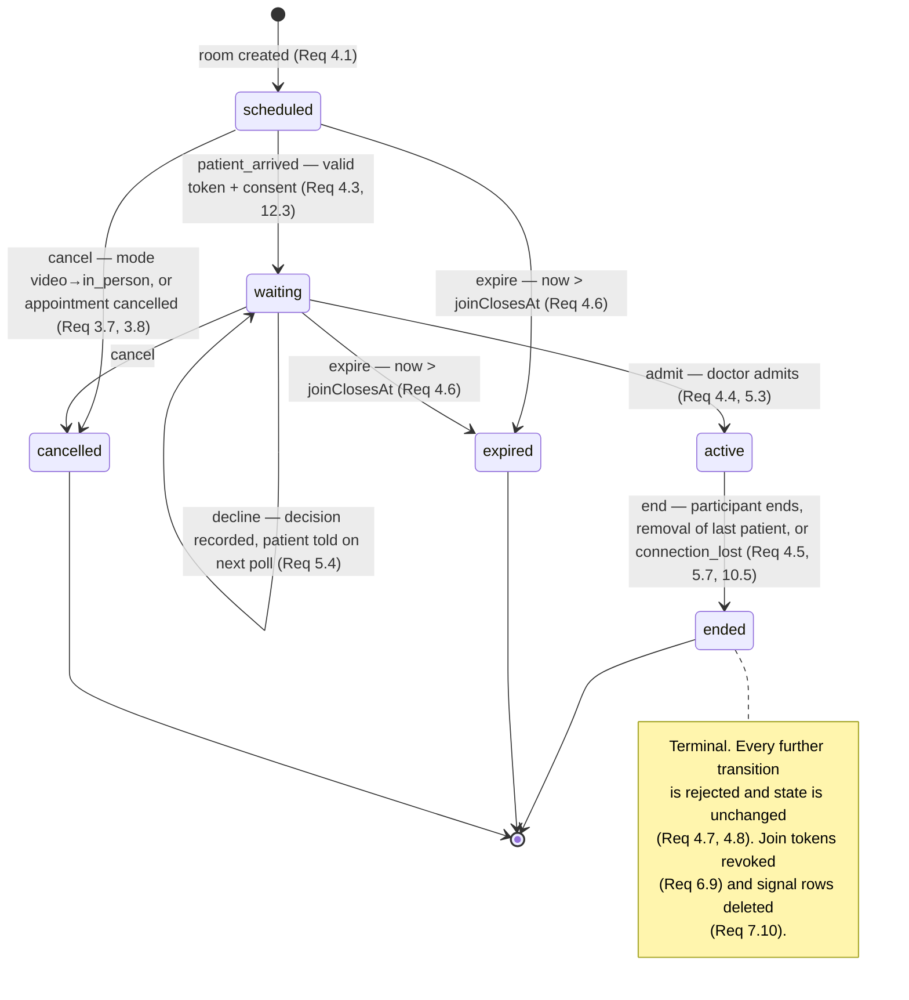
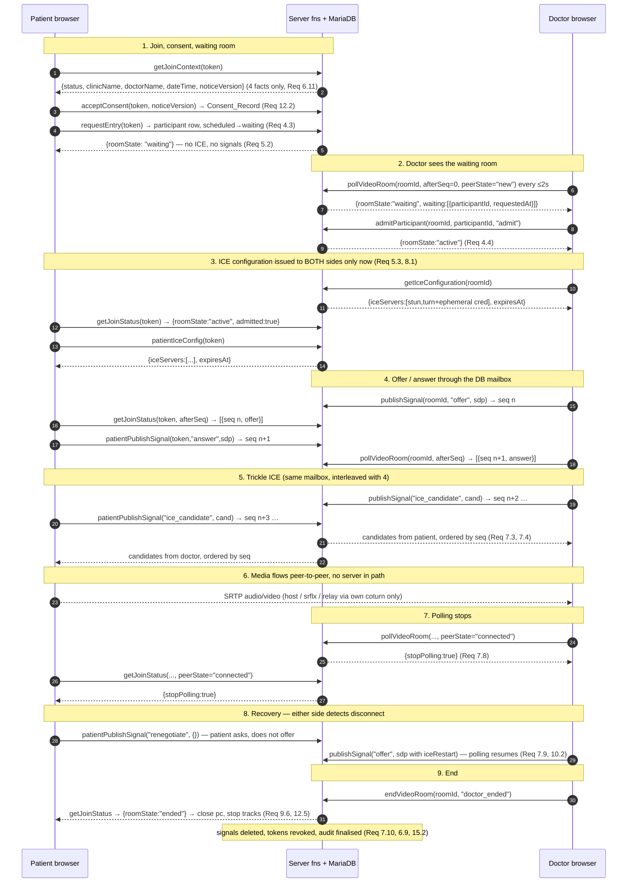

# Design Document

## Overview

This feature adds a first-party 1:1 video consultation capability to BookMyTime. A doctor starts a session from the medical dashboard; the patient opens a tokenized link with no login, acknowledges a teleconsultation notice, and lands in a waiting room; the doctor admits them; the browsers then negotiate a native WebRTC peer connection and exchange audio and video directly.

Everything that supports that call is built here. There is no video vendor, no hosted signalling, and no third-party STUN or TURN — not even Google's public STUN. The only external moving part is a **self-hosted coturn** deployment addressed purely through environment configuration, and the design must (and does) work with that configuration absent, which is how local development runs (Requirements 11, 16.8).

The four load-bearing decisions, all pre-agreed and treated here as given:

| Decision | Why it holds | Requirements |
|---|---|---|
| Native `RTCPeerConnection`, 1:1 P2P media | WebRTC is a browser standard, not a vendor service. No SFU, no media server, no new npm dependency. | 9.1, 9.7, 11.1, 11.4, 11.5 |
| Signalling persisted in MariaDB, read via polled HTTP server functions | The project runs `nitro 3.0.260603-beta` with no WebSocket layer. Polling is capped at 2s, happens only during setup, and stops once the peer connection is up. | 7.2, 7.7, 7.8 |
| Ephemeral HMAC TURN credentials minted server-side | coturn's `use-auth-secret` REST scheme lets us hand the browser a ≤1h credential while the shared secret never leaves the server. | 8.2, 8.3, 8.4 |
| Profession becomes a third gating dimension alongside plan and role | Video is clinical; it must not appear in gym, salon, education, or professional-services tenants. | 1.1–1.7, 2.1–2.8 |

### Goals

- One `Video_Room` per video appointment, with an explicit, server-authoritative state machine (`scheduled → waiting → active → ended | expired | cancelled`).
- Doctor-controlled admission: a patient who holds a valid link still gets nothing — no ICE configuration, no signal messages — until the doctor admits them (Req 5.2).
- Patient joins with a high-entropy bearer token stored only as a one-way hash, valid inside a configurable window around the appointment time, revocable, rate limited, and disclosing four facts and nothing more (Req 6).
- Pure, isomorphic decision logic (state machine, join window, token scope, outcome classification, signal ordering, quality grading, poll cadence) isolated in modules with no I/O so it can be property-tested with `fast-check`.
- Additive-only schema changes and a minimal touch on `src/routes/dashboards/medical.tsx` (12,059 lines) — all new UI lives in `src/components/video/*`.

### Non-Goals

- Multi-party calls and any SFU/MCU. Out of scope, but participant presence is modelled as a **set of participant rows with a role field**, not two columns on the room, so a third participant is an insert rather than a migration (Req 4.10).
- Recording. Never enabled; the UI reports `not recorded` to both sides (Req 12.7).
- WebSocket or SSE transport, background job infrastructure, Prisma migrations (`prisma/schema.prisma` is vestigial — 4 models against 31 live tables), or any new video-related dependency.
- Screen sharing, chat, file transfer, waiting-room queues longer than one patient.

## Architecture

### Module map

```
                    ┌──────────────────────────────────────────────────────────┐
                    │  src/lib/video-consultation.ts   (PURE, isomorphic)      │
                    │  room state machine · join window · token scope check    │
                    │  signal ordering/filtering · outcome classification      │
                    │  quality grading · poll cadence · mode validation        │
                    └───────────────┬──────────────────────────┬───────────────┘
                                    │                          │
        ┌───────────────────────────▼──────────┐   ┌────────────▼─────────────────┐
        │ src/lib/video.ts                     │   │ src/lib/video-peer.ts        │
        │ server functions (doctor + patient)  │   │ browser RTCPeerConnection    │
        │ createServerFn(...).validator(...)   │   │ perfect negotiation · ICE     │
        └───┬───────────────┬──────────────┬───┘   │ restart · getStats sampling  │
            │               │              │        └────────────┬────────────────┘
  ┌─────────▼────┐  ┌───────▼──────┐  ┌────▼──────────┐          │
  │ video.server │  │ video-turn   │  │ feature-access│   ┌──────▼────────────────┐
  │ .ts          │  │ .server.ts   │  │ .ts (+video,  │   │ src/components/video/ │
  │ rooms·tokens │  │ HMAC creds   │  │  +profession) │   │ Doctor panel · patient│
  │ signals·audit│  │ ICE config   │  └───────────────┘   │ page · shell · devices│
  │ rate limit   │  └──────┬───────┘                      └──────┬────────────────┘
  └───┬──────────┘         │                                     │
      │                    │ env only                    ┌───────▼────────────────┐
  ┌───▼─────────┐   ┌──────▼───────────┐                │ routes/consult.$token  │
  │ src/lib/db  │   │ self-hosted      │                │ (public, no session)   │
  │ query/exec  │   │ coturn (STUN+TURN)│                │ dashboards/medical.tsx │
  └─────────────┘   └──────────────────┘                └────────────────────────┘
              │
      ┌───────▼────────────────────────────────┐
      │ appointment-notify.ts (+2 kinds, link) │
      │ email.ts · reminder-scheduler.ts (sweep)│
      └────────────────────────────────────────┘
```

Media never touches the application server. The server is a state machine, a mailbox, and a credential minter.

### Room state machine

Server-authoritative. Every transition goes through one pure function; no call site mutates `state` directly.



Notes on edges that are deliberately absent:

- `active → expired` does not exist. Once a call is live, passing the join window does not kill it; it ends via `end` (Req 4.6 names only `scheduled` and `waiting`).
- `decline` is a self-loop on `waiting`, not a state. Declining records a participant-level decision and an audit row; the room stays available so the doctor can still admit a later arrival, and the declined patient reads `declined` on the next poll (Req 5.4).
- There is no `active → waiting`. A reload while `active` re-attaches to the same room and the same participant row (Req 10.6) rather than re-entering the waiting room.

### Signalling, offer/answer, and ICE — full sequence

Roles are fixed, so perfect negotiation needs no tiebreaker: the **doctor is the impolite/offering peer**, the **patient is the polite/answering peer**. Collisions are resolved by the patient rolling back, and only the doctor initiates ICE restart (the patient asks for one with a `renegotiate` signal).



### Polling lifecycle, cadence, and load

Two polling endpoints exist, one per side, and each returns **room state + admission state + new signals in a single round trip**. That is deliberate: it halves request count versus separate status and signal endpoints, and it means the browser never sees a torn view where the state says `active` but the offer is one request behind.

Client cadence, computed by the pure `nextPollDelayMs(...)`:

| Condition | Interval |
|---|---|
| `scheduled` or `waiting` | 2000 ms (Req 7.7) |
| `active` and local peer state ∉ {`connected`, `completed`} | 2000 ms (Req 7.9) |
| `active` and both peers report connected | stop (Req 7.8) |
| Peer state returns to `disconnected` / `failed` / `negotiationneeded` fires | resume at 2000 ms (Req 7.9, 10.2) |
| Server error or non-2xx | 2000 → 4000 → 8000 → 15000 ms cap, reset on success; **peer connection is never torn down** (Req 16.7) |
| Terminal room state | stop permanently |

Server-side guards, because a client is not trusted to respect its own cadence:

- Each poll stamps `VideoParticipant.lastPolledAt`. A poll arriving < 1500 ms after the previous one for the same participant returns `{ throttled: true, nextPollMs }` **without** running the signal query. 1500 ms rather than 2000 ms tolerates clock and latency jitter while still bounding work per participant to ~0.67 queries/s.
- `stopPolling` is computed server-side from both participants' last reported `peerState`, so one side cannot keep the other polling forever.

Load characteristics (Req 7.10):

- Steady state is **zero** polling for connected calls — the expensive phase is bounded to the seconds between admission and ICE completion, typically under 10 s.
- Per poll the server runs at most three statements: one `queryOne` for the room, one range scan `WHERE roomId = ? AND seq > ?` on the covering index `(roomId, seq)`, and (only while `waiting`) one small waiting-list read.
- 50 concurrent calls *in setup* ≈ 50 req/s and ~150 indexed statements/s, which is unremarkable for this deployment. Calls that are already connected contribute nothing.
- `VideoSignal` rows are deleted the moment a room reaches a terminal state (Req 7.10), so the table's working set stays proportional to *concurrent setups*, not to historical call volume. A sweeper deletes signal rows for any room that is terminal and older than 10 minutes, covering crashed clients and rooms that went terminal by expiry.

### Expiry: lazy evaluation plus a sweeper (Req 4.6, 15.3, 15.4)

Expiry is a time-triggered transition, and this codebase has exactly one recurring mechanism: `src/lib/reminder-scheduler.ts`, which ticks every 5 minutes. Neither mechanism alone is adequate:

- **Sweeper only** is too coarse. A patient polling at 2 s would keep seeing `waiting` for up to 5 minutes after the window closed. Requirement 6.5 wants an expired link reported as expired, promptly.
- **Lazy only** never fires for rooms nobody reads, so a no-show that neither party ever revisits would sit in `scheduled` forever and never record `patient_no_show` (Req 15.3).

So: **lazy evaluation is authoritative for reads, the sweeper guarantees eventual persistence.**

1. Every read or transition that loads a room first calls the pure `evaluateJoinWindow(now, window)`. If the room is `scheduled` or `waiting` and the window has closed, the loader applies the `expire` transition *before* answering, so no caller ever observes a stale non-terminal state. This makes expiry correct within one poll interval at no extra cost.
2. A `sweepExpiredVideoRooms()` pass is registered in the existing reminder cycle (same `globalForScheduler`-style singleton guard, same 5-minute tick, no new infrastructure). It selects rooms `WHERE state IN ('scheduled','waiting') AND joinClosesAt < NOW(3)`, applies the same transition through the same helper, records the no-show outcome, revokes tokens, and deletes signal rows. It also deletes signal rows for rooms terminal for more than 10 minutes.

Both paths call **one** function, `expireVideoRoom(roomId, now)`, which is idempotent and guarded by `WHERE state IN ('scheduled','waiting')` so a concurrent lazy expiry and sweep cannot double-write or disagree. Adding a pass to an existing 5-minute scheduler is a smaller operational surface than a new timer, and the lazy path means the scheduler's coarse cadence is never user-visible.

## Components and Interfaces

### 1. `src/lib/video-consultation.ts` — pure, isomorphic decision logic (new)

No I/O, no `crypto`, no DB. Runs on client and server identically, and is the primary target of the property tests.

```ts
export type RoomState = "scheduled" | "waiting" | "active" | "ended" | "expired" | "cancelled";
export type TransitionKind = "patient_arrived" | "admit" | "decline" | "end" | "expire" | "cancel";
export type ConsultationMode = "in_person" | "video";
export type SignalKind = "offer" | "answer" | "ice_candidate" | "renegotiate";
export type ParticipantRole = "doctor" | "patient";
export type ParticipantStatus = "requested" | "admitted" | "declined" | "left" | "removed";
export type CallOutcome = "completed" | "abandoned" | "patient_no_show" | "doctor_no_show" | "cancelled";
export type EndReason = "doctor_ended" | "patient_ended" | "participant_removed" | "connection_lost" | "cancelled" | "expired";
export type QualityLevel = "good" | "fair" | "poor";
export type JoinWindowVerdict = "early" | "open" | "closed";
export type PeerState = "new" | "connecting" | "connected" | "disconnected" | "failed" | "closed";

export const ROOM_STATES: readonly RoomState[];
export const TERMINAL_ROOM_STATES: readonly RoomState[];            // ended, expired, cancelled
export const CONSULTATION_MODES: readonly ConsultationMode[];
export const SIGNAL_KINDS: readonly SignalKind[];
export const MAX_SIGNAL_PAYLOAD_BYTES = 64 * 1024;                   // Req 7.11

/** Single source of truth for the diagram above. */
export const ROOM_TRANSITIONS: Record<RoomState, Partial<Record<TransitionKind, RoomState>>>;

export function isTerminalRoomState(s: RoomState): boolean;
export function canTransition(from: RoomState, kind: TransitionKind): boolean;
export type TransitionResult =
  | { ok: true; next: RoomState }
  | { ok: false; next: RoomState; reason: "terminal" | "not_permitted" };   // next === from
export function applyTransition(from: RoomState, kind: TransitionKind): TransitionResult;

export interface JoinWindowConfig { beforeMinutes: number; afterMinutes: number }
export interface JoinWindow { opensAt: number; closesAt: number }         // epoch ms
export function computeJoinWindow(appointmentAt: number, cfg: JoinWindowConfig): JoinWindow;
export function evaluateJoinWindow(nowMs: number, w: JoinWindow): JoinWindowVerdict;

export interface SignalRecord { seq: number; kind: SignalKind; senderRole: ParticipantRole; payload: string }
/** Ascending by seq, strictly greater than cursor, order-preserving. */
export function selectSignalsAfter(all: SignalRecord[], cursor: number, forRole: ParticipantRole): SignalRecord[];
export function nextCursor(selected: SignalRecord[], cursor: number): number;
export function validateSignalPayload(kind: string, payload: string):
  | { ok: true; kind: SignalKind }
  | { ok: false; reason: "unknown_kind" | "too_large" | "empty" };        // Req 7.11

export interface OutcomeInput {
  terminalState: Extract<RoomState, "ended" | "expired" | "cancelled">;
  patientEverAdmitted: boolean;
  patientEverWaited: boolean;
  admissionDecisionRecorded: boolean;
  connectedSeconds: number;
  existingOutcome: CallOutcome | null;
}
export function classifyOutcome(i: OutcomeInput): CallOutcome;            // Req 15.3–15.6

export interface QualitySample { rttMs: number | null; packetLossPct: number | null; jitterMs: number | null }
export function classifyQuality(s: QualitySample): QualityLevel;          // Req 10.1

export function nextPollDelayMs(i: {
  roomState: RoomState; localPeer: PeerState; remotePeer: PeerState; consecutiveErrors: number;
}): number | null;                                                        // null === stop polling
export function shouldStopPolling(roomState: RoomState, localPeer: PeerState, remotePeer: PeerState): boolean;

export function normalizeConsultationMode(v: unknown):
  | { ok: true; mode: ConsultationMode }
  | { ok: false; reason: "invalid" };                                     // Req 3.5
export type RoomSyncAction = "create" | "cancel" | "none";
export function planRoomSyncForModeChange(i: {
  from: ConsultationMode | null; to: ConsultationMode; hasRoom: boolean; roomState: RoomState | null;
}): RoomSyncAction;                                                       // Req 3.6, 3.7

export function shouldEndForDisconnect(totalDisconnectedMs: number): boolean;   // ≥ 60_000, Req 10.5
export function isTokenScopedTo(tokenRoomId: string, requestedRoomId: string, tokenRevoked: boolean): boolean; // Req 6.10

export interface RateLimitState { hits: number[] }                        // epoch ms of failed attempts
export function evaluateRateLimit(state: RateLimitState, nowMs: number):
  { allowed: boolean; state: RateLimitState };                            // 10 per 60s, Req 6.12

/** The ONLY fields a patient may ever see. Enforced by construction. */
export interface PatientRoomProjection {
  status: "waiting" | "admitted" | "declined" | "active" | "ended" | "expired" | "invalid" | "rate_limited";
  clinicName: string | null; doctorName: string | null; appointmentAt: string | null; noticeVersion: string;
}
export function projectForPatient(i: {...}): PatientRoomProjection;       // Req 6.6, 6.11
```

### 2. `src/lib/feature-access.ts` — add `video` and a profession dimension (modified)

Requirement 1 needs profession to affect the resolver, and Requirement 2.8 forbids changing any other feature's behaviour. The module must stay pure.

The chosen mechanism is a **restriction map keyed by feature**, defaulting to unrestricted:

```ts
export type FeatureId = "whatsapp" | "analytics" | "scribe" | "users" | "locations" | "plans" | "video";

export const FEATURE_IDS: FeatureId[] = [..., "video"];

export const HEALTHCARE_PROFESSION = "Healthcare and medical";

/** Features restricted to specific professions. Absent key === available to all professions. */
export const PROFESSION_FEATURES: Partial<Record<FeatureId, readonly string[]>> = {
  video: [HEALTHCARE_PROFESSION],
};

export function professionAllowsFeature(profession: string | null | undefined, feature: FeatureId): boolean {
  const allowed = PROFESSION_FEATURES[feature];
  if (!allowed) return true;                                  // unrestricted → unchanged behaviour
  return allowed.includes((profession ?? "").trim());          // exact match, fail closed
}

export interface AccountContext {
  role: AccountRole;
  profession?: string | null;        // NEW — parent tenant's profession
  subscriptionPlan?: string | null;
  subscriptionStatus?: string | null;
  subscriptionExpiresAt?: string | null;
  isActive?: boolean;
  now?: Date;
}
```

`resolveFeatureAccess` gains exactly one conjunct:

```ts
const available =
  active && childOk &&
  planIncludesFeature(plan, feature) &&
  professionAllowsFeature(ctx.profession, feature);     // no-op for every pre-existing feature
```

Map entries (Req 2.1 requires an entry in both maps for every tier and every role):

| Feature | Basic | Premium | Enterprise |
|---|:--:|:--:|:--:|
| `video` | ✗ | ✓ | ✓ |

| Feature | admin | doctor | reception | location |
|---|---|---|---|---|
| `video` | operate | operate | **none** | **none** |

`reception: "none"` and `location: "none"` satisfy Req 2.4 and follow the existing `scribe` precedent for reception. `none` means the tab does not render *and* every server function rejects the caller, including read-only ones (Req 2.7), because `canUseFeature` requires `permission !== "none"`.

Plan tier choice: `video` matches the `whatsapp` shape (Premium and above). Recorded as an assumption below.

**Why the existing 453-line property suite in `src/lib/feature-access.test.ts` stays green.** Its generic assertions iterate `FEATURE_IDS` and check: availability is identical across roles; a child's availability equals admin's; alias resolution equals canonical resolution; `permission !== "none"` and `visible` imply `available`; inactive/expired ⇒ all `available === false`; `isActive === false` ⇒ all `available === false`; and availability is monotonic across Basic → Premium → Enterprise. None of them asserts `available === planIncludesFeature(plan, f)` — verified by reading the file. The generators build contexts without a `profession` field, so for the newly added `video` id `professionAllowsFeature(undefined, "video")` is `false` and `video.available` is `false` in every generated case. `false` is role-independent, equal between parent and child, equal across aliases, implies nothing about permission, is already `false` when inactive, and is trivially monotonic (`false ≤ false ≤ false`). Every pre-existing feature is untouched because it has no `PROFESSION_FEATURES` entry (Req 2.8). New tests are added for the profession dimension rather than existing ones being edited.

**Context construction.** `buildAccountContext(user)` in `src/lib/auth.ts` (~line 16) gains `profession: user.profession`. No default is applied there, because `verifySession` in `src/lib/auth.server.ts` **already** selects `u.profession` for all three session kinds (admin via `Session → User`, sub-user and sub-location via a join to the parent `User`) and already coalesces null to `"Healthcare and medical"`. That means Req 1.3 — sub-user and sub-location eligibility derived from the *parent's* profession — is satisfied by existing plumbing with no query changes, and the legacy null-profession default is inherited rather than newly invented. The pure resolver stays strict (unknown profession ⇒ unavailable) so the server never fails open.

### 3. `src/lib/video-turn.server.ts` — ICE configuration and ephemeral credentials (new)

Server-only. Deterministic given `now`, so it is directly property-testable under vitest's node environment.

```ts
export interface TurnConfig {
  stunUrls: string[]; turnUrls: string[]; realm: string | null; sharedSecret: string | null; ttlSeconds: number;
}
export function readTurnConfig(env = process.env): TurnConfig;            // Req 8.5
export function isTurnConfigured(cfg: TurnConfig): boolean;               // turnUrls non-empty AND sharedSecret non-empty

/** coturn REST scheme: username = "<unixExpiry>:<id>". */
export function buildTurnUsername(expiryUnix: number, id: string): string;
export function parseTurnUsername(u: string): { expiryUnix: number; id: string } | null;
/** base64( HMAC-SHA1( username, sharedSecret ) ) — coturn `use-auth-secret`. */
export function deriveTurnPassword(username: string, sharedSecret: string): string;

export interface EphemeralTurnCredential { username: string; credential: string; expiresAtUnix: number; ttlSeconds: number }
export function mintTurnCredential(cfg: TurnConfig, participantId: string, nowMs: number): EphemeralTurnCredential;

export interface IceConfiguration {
  iceServers: Array<{ urls: string[]; username?: string; credential?: string }>;
  iceTransportPolicy: "all";
  expiresAtUnix: number | null;
  turnConfigured: boolean;                                               // drives the Req 8.7 notice
}
export function buildIceConfiguration(cfg: TurnConfig, participantId: string, nowMs: number): IceConfiguration;
```

Derivation, matching coturn's `use-auth-secret` / TURN REST API scheme:

```
ttl        = clamp(TURN_CREDENTIAL_TTL_SECONDS ?? 3600, 1, 3600)          // Req 8.3 — hard ceiling
expiryUnix = floor(nowMs / 1000) + ttl
username   = `${expiryUnix}:${participantId}`
credential = createHmac("sha1", sharedSecret).update(username).digest("base64")   // Req 8.2
```

The shared secret is read from `process.env` inside a `.server.ts` module and appears in no return value, no log line, and no error message (Req 8.4). Only `username` and `credential` cross to the browser. Renewal (Req 8.9) is just another call to the same server function while the room is `active`; the client re-arms `setConfiguration({ iceServers })` at 80% of TTL and on any credential-expiry ICE failure.

**Unconfigured deployment** (Req 8.6, 8.7, 16.8): `isTurnConfigured` false ⇒ `{ iceServers: [], turnConfigured: false }`. `RTCPeerConnection` with an empty server list still gathers **host candidates**, which is exactly what two browsers on the same LAN (or the same machine) need, so `npm run dev` connects with no coturn and no public STUN. Being precise about Req 8.6: server-reflexive candidates require a STUN server, so with nothing configured only host (and mDNS) candidates exist — a same-network dev connection is unaffected, and cross-NAT connections are expected to fail, which is why the doctor UI shows the Req 8.7 notice whenever `turnConfigured` is `false`.

### Environment configuration

| Variable | Default | Purpose | Req |
|---|---|---|---|
| `TURN_URLS` | *(empty)* | Comma-separated TURN URLs, e.g. `turn:turn.example.com:3478?transport=udp,turns:turn.example.com:5349?transport=tcp` | 8.1, 8.5, 11.3 |
| `TURN_STUN_URLS` | *(empty)* | Comma-separated STUN URLs on the **same** self-hosted host, e.g. `stun:turn.example.com:3478` | 8.1, 11.3 |
| `TURN_REALM` | *(empty)* | coturn realm | 8.5 |
| `TURN_SHARED_SECRET` | *(empty)* | `static-auth-secret`; server-only | 8.2, 8.4 |
| `TURN_CREDENTIAL_TTL_SECONDS` | `3600` | Clamped to `[1, 3600]` | 8.3 |
| `VIDEO_JOIN_WINDOW_BEFORE_MINUTES` | `30` | Join window opens this long before `Appointment.dateTime` | 6.4 |
| `VIDEO_JOIN_WINDOW_AFTER_MINUTES` | `120` | Join window closes this long after `Appointment.dateTime` | 6.4 |
| `VIDEO_NOTICE_VERSION` | `v1` | Teleconsultation notice version stamped on consent | 12.2 |
| `APP_ORIGIN` | existing | Absolute base for the join link (`https://bookmytime.tech` in prod) | 6.3, 12.8, 13.1 |

No video-related variable names a vendor, and populating `iceServers` from anything other than these variables is prohibited (Req 11.3). An empty `TURN_URLS` is a valid, supported configuration — never a fallback to a public server.

### coturn configuration sketch (operator-side, outside this repo)

```conf
listening-port=3478
tls-listening-port=5349
realm=turn.example.com
server-name=turn.example.com

# REST API / ephemeral credentials — same value as TURN_SHARED_SECRET
use-auth-secret
static-auth-secret=<TURN_SHARED_SECRET>

fingerprint
no-multicast-peers
no-cli
no-tlsv1
no-tlsv1_1

# TLS for turns: (also lets TURN traverse egress filtering on 443/5349)
cert=/etc/letsencrypt/live/turn.example.com/fullchain.pem
pkey=/etc/letsencrypt/live/turn.example.com/privkey.pem

# Relay port range must be open in the firewall/security group
min-port=49152
max-port=65535
external-ip=<public-ip>/<private-ip>

# Do not let relayed traffic reach internal networks
denied-peer-ip=10.0.0.0-10.255.255.255
denied-peer-ip=172.16.0.0-172.31.255.255
denied-peer-ip=192.168.0.0-192.168.255.255
denied-peer-ip=127.0.0.0-127.255.255.255

total-quota=100
user-quota=12
```

Operational note: relay bandwidth is the operator's cost, and TURN is only used when both peers are behind symmetric NAT, so most calls stay direct.

### 4. `src/lib/video.server.ts` — persistence and enforcement helpers (new, server-only)

Raw SQL through `query` / `queryOne` / `execute` from `src/lib/db.ts`. Every statement is tenant-scoped (Req 12.9).

```ts
// ---- tokens (Req 6) ----
export function generateJoinToken(): { token: string; hash: string };     // 32 random bytes → base64url; hash = sha256 hex
export function hashJoinToken(token: string): string;
export async function issueJoinToken(roomId: string, tenantId: string, purpose: "created" | "regenerated" | "reminder"): Promise<{ token: string; link: string }>;
export async function revokeJoinTokens(roomId: string): Promise<void>;    // Req 6.8, 6.9
export interface ResolvedToken { room: VideoRoomRow; tokenId: string; tokenVersion: number }
export async function resolveJoinToken(token: string, clientKey: string): Promise<
  | { ok: true; value: ResolvedToken }
  | { ok: false; status: "invalid" | "expired" | "rate_limited" }>;       // Req 6.5, 6.6, 6.12

// ---- rooms ----
export async function ensureVideoRoom(appointmentId: string, tenantId: string): Promise<VideoRoomRow>;   // idempotent, Req 3.3, 3.6, 4.1, 4.2
export async function loadRoomForRead(roomId: string, tenantId: string): Promise<VideoRoomRow>;           // applies lazy expiry
export async function transitionRoom(roomId: string, kind: TransitionKind, ctx: TransitionContext): Promise<VideoRoomRow>;  // the ONLY writer of `state`
export async function expireVideoRoom(roomId: string, nowMs: number): Promise<void>;                      // idempotent
export async function sweepExpiredVideoRooms(): Promise<void>;                                             // called by reminder cycle

// ---- signals ----
export async function allocateSignalSeq(roomId: string): Promise<number>; // UPDATE … SET signalSeq = LAST_INSERT_ID(signalSeq + 1)
export async function insertSignal(...): Promise<void>;
export async function readSignalsAfter(roomId: string, tenantId: string, cursor: number, forRole: ParticipantRole): Promise<SignalRecord[]>;
export async function deleteSignals(roomId: string): Promise<void>;       // Req 7.10

// ---- participants & audit ----
export async function upsertParticipant(...): Promise<VideoParticipantRow>;
export async function recordAudit(roomId: string, kind: string, detail?: string, role?: ParticipantRole): Promise<void>;  // never throws
export async function finalizeRoomOutcome(roomId: string): Promise<void>; // uses classifyOutcome

// ---- guards ----
export async function requireVideoOperator(): Promise<SessionUser>;       // verifySession + canOperateFeature(ctx,"video")
export async function requireRoomForDoctor(roomId: string, user: SessionUser): Promise<VideoRoomRow>;     // Req 5.6
```

`transitionRoom` is the single choke point. It loads the room `FOR UPDATE` inside a transaction on a dedicated connection, calls the pure `applyTransition`, writes only when `ok`, appends the audit row, and on a terminal result revokes tokens, deletes signal rows, and calls `finalizeRoomOutcome`. An illegal transition throws `new Error("...")` and writes nothing (Req 4.7, 4.8, 16.6).

Signal sequence allocation uses MariaDB's `LAST_INSERT_ID(expr)` trick so the counter is atomic under concurrent publishes from both sides:

```sql
UPDATE VideoRoom SET signalSeq = LAST_INSERT_ID(signalSeq + 1) WHERE id = ? AND tenantId = ?;
-- execute() returns insertId === the new seq
```

Ordering is therefore by `seq`, not by timestamp, which gives a strict total order immune to same-millisecond collisions (Req 7.4).

### 5. `src/lib/video.ts` — server function surface (new)

All follow the house pattern: `createServerFn({ method }).validator((data: {...}) => { ...checks; return data; }).handler(async ({ data }) => {...})`, exported as `xxxServerFn`, errors as `new Error("message")`.

**Doctor / staff path — `verifySession()` then `canOperateFeature(buildAccountContext(user), "video")`.** Both guards run on every function, so profession and plan are enforced server-side regardless of what the UI rendered (Req 1.6, 1.7, 2.6, 2.7).

| Server function | Method | Validator input | Returns | Requirements |
|---|---|---|---|---|
| `getVideoRoomServerFn` | GET | `{ appointmentId }` | room state, window, participants, waiting list, `turnConfigured`, audit summary, whether a link is active | 5.1, 8.7, 14.6, 15.7 |
| `createVideoRoomServerFn` | POST | `{ appointmentId }` | `{ room, joinLink }` — plaintext token returned **once** | 3.3, 3.6, 4.1, 6.1, 6.7, 13.1 |
| `regenerateJoinTokenServerFn` | POST | `{ roomId }` | `{ joinLink }`, all prior tokens revoked | 6.8, 13.2 |
| `pollVideoRoomServerFn` | GET | `{ roomId, afterSeq, peerState }` | `{ roomState, waiting[], signals[], cursor, stopPolling, nextPollMs, throttled? }` | 5.1, 7.3, 7.4, 7.7–7.9 |
| `publishSignalServerFn` | POST | `{ roomId, kind, payload }` | `{ seq }` | 7.1, 7.6, 7.11 |
| `admitParticipantServerFn` | POST | `{ roomId, participantId, decision }` | `{ roomState }` | 4.4, 5.3, 5.4, 5.6, 5.8 |
| `removeParticipantServerFn` | POST | `{ roomId, participantId }` | `{ roomState }` | 5.7 |
| `getIceConfigurationServerFn` | POST | `{ roomId }` | `IceConfiguration` (only when `active` and caller admitted) | 8.1–8.4, 8.6, 8.9 |
| `endVideoRoomServerFn` | POST | `{ roomId, reason }` | `{ roomState, connectedSeconds, outcome }` | 4.5, 10.5, 12.5, 15.2 |
| `reportCallEventServerFn` | POST | `{ roomId, kind, detail?, peerState?, connectedMs? }` | `{ ok }` | 8.8, 10.5, 10.7, 15.1 |
| `getCallAuditServerFn` | GET | `{ appointmentId }` | join/leave events, connected duration, end reason, outcome | 15.7, 15.8 |

`getIceConfigurationServerFn` is `POST` despite being read-shaped: it mints a credential and writes an audit row, so it must not be cacheable or replayable as a navigation.

**Patient path — Join_Token only, `verifySession` is never called.** These functions resolve the caller through `resolveJoinToken`, which yields the room (and therefore the `tenantId`) or a redacted failure. They perform no profession/plan check of their own: the room could only exist if the tenant was eligible when it was created, and the doctor-side guards prevent creation otherwise.

| Server function | Method | Validator input | Returns | Requirements |
|---|---|---|---|---|
| `getJoinContextServerFn` | GET | `{ token }` | `PatientRoomProjection` — clinic name, doctor name, appointment datetime, status, notice version | 6.3, 6.5, 6.6, 6.11, 6.12, 12.1 |
| `acceptConsentServerFn` | POST | `{ token, noticeVersion }` | `{ ok }` + Consent_Record | 12.2 |
| `requestEntryServerFn` | POST | `{ token }` | `{ status }`; refuses without consent | 4.3, 12.3, 12.4 |
| `getJoinStatusServerFn` | GET | `{ token, afterSeq, peerState }` | `{ status, signals[], cursor, stopPolling, nextPollMs }` — signals only once admitted | 5.2, 5.5, 7.3, 7.7–7.9 |
| `patientPublishSignalServerFn` | POST | `{ token, kind, payload }` | `{ seq }`; rejected unless admitted | 7.1, 7.6, 7.11 |
| `patientIceConfigServerFn` | POST | `{ token }` | `IceConfiguration`; rejected unless admitted | 5.2, 8.1, 8.9 |
| `patientReportEventServerFn` | POST | `{ token, kind, peerState?, connectedMs? }` | `{ ok }` | 10.5, 15.1 |
| `patientLeaveServerFn` | POST | `{ token, reason }` | `{ status }` | 9.6, 15.1 |

**Appointment integration (modifications, not new functions).** `createAppointmentServerFn` (auth.ts:737) and `updateAppointmentServerFn` (auth.ts:1072) gain an optional `consultationMode` in their validators, run it through `normalizeConsultationMode` (Req 3.5), default it to `in_person` (Req 3.2), reject `video` when `canOperateFeature(ctx,"video")` is false with a message naming the capability (Req 3.4), and then call `syncVideoRoomForAppointment` which applies `planRoomSyncForModeChange` — `create` calls `ensureVideoRoom` + `issueJoinToken` + notify, `cancel` calls `transitionRoom(…, "cancel")` (Req 3.7, 3.8), `none` does nothing. `appointmentType` is never read or written by any of this (Req 3.9). The existing cancel path in `updateAppointmentServerFn` also triggers `cancel` when `status` becomes `Cancelled` (Req 3.8).

### 6. `src/lib/video-peer.ts` — browser WebRTC controller (new)

A framework-free class wrapping one `RTCPeerConnection`, driven by the pure module. Native APIs only: `navigator.mediaDevices.getUserMedia`, `enumerateDevices`, `RTCPeerConnection`, `RTCRtpSender.replaceTrack`, `getStats` (Req 11.5).

- **Perfect negotiation.** `role: "doctor"` ⇒ impolite and the offerer; `role: "patient"` ⇒ polite and the answerer. On `negotiationneeded` the doctor creates an offer; on an incoming offer during `have-local-offer` the patient rolls back, the doctor ignores. Because roles are fixed there is no glare tiebreak to get wrong.
- **Transceivers.** `addTransceiver("audio", {direction:"sendrecv"})` and the same for video are added up front so an audio-only participant still negotiates a video m-line and can enable a camera later without a fresh offer (Req 16.2).
- **Device switching** uses `replaceTrack` on the existing sender, so changing microphone, camera, or speaker (`setSinkId`) never renegotiates and never drops the session (Req 9.5).
- **Track toggles** set `track.enabled` and publish the resulting state through `reportCallEvent`, so the peer's UI shows the other side's mic/camera state (Req 9.3, 9.4).
- **Quality sampling** every 5000 ms: `getStats()` → inbound RTP `jitter`, `packetsLost` delta over `packetsReceived` delta, and `currentRoundTripTime` from the selected candidate pair → `classifyQuality` (Req 10.1).
- **Recovery.** On `iceconnectionstatechange → disconnected`: show reconnecting, resume polling, and (doctor) `createOffer({ iceRestart: true })`; the patient publishes `renegotiate` and waits. Retry with 2 s / 4 s / 8 s spacing while disconnected (Req 10.2, 10.4). A cumulative disconnected budget is tracked; at ≥60 s `shouldEndForDisconnect` fires `endVideoRoom(reason:"connection_lost")` no matter how many restarts were attempted (Req 10.5). A successful restart clears the banner and the room stays `active` (Req 10.3).
- **Connect deadline.** If `connectionState` has not reached `connected` within 45 s of admission, report `connection_failed` to both sides and audit it; the room is *not* forced terminal so a retry is possible (Req 10.7, 11.7).
- **Teardown.** `close()` stops every local track, closes the peer connection, and releases camera and microphone; media buffers are dropped with the connection and nothing is written anywhere (Req 9.6, 12.5, 12.6).
- **Reload.** State is reconstructed from the server on mount, so refreshing while `active` inside the join window rejoins the same room and the same participant row (Req 10.6).

### 7. UI composition

New components, none of them in `medical.tsx`:

| File | Responsibility |
|---|---|
| `src/components/video/DoctorVideoConsultPanel.tsx` | Tab body: today's video appointments, room state badges, waiting-room list with Admit/Decline, copy/regenerate link, the `turnConfigured === false` notice (Req 8.7), and the launcher for the call shell |
| `src/components/video/VideoCallShell.tsx` | Local preview + remote video, mic/camera toggles, device pickers, quality badge, `not recorded` indicator (Req 12.7), reconnecting banner, end-call control |
| `src/components/video/PreflightCheck.tsx` | WebRTC support probe, device enumeration, permission request, and the Req 16.1/16.3/16.4 error states with a retry control |
| `src/components/video/ConsentNotice.tsx` | Teleconsultation notice, version-stamped acknowledgement gate before any `getUserMedia` call (Req 12.1) |
| `src/components/video/PatientConsultPage.tsx` | Consent → preflight → waiting → in-call → ended flow for the patient |
| `src/components/video/CallDocumentationDrawer.tsx` | Side drawer hosting the **existing** SOAP note and prescription forms during an active call (Req 14.1) |
| `src/routes/consult.$token.tsx` | Public unauthenticated route, following the `src/routes/book.$tenantId.tsx` precedent; renders `PatientConsultPage` |

`medical.tsx` changes are deliberately three small edits: add a `video` entry to the tab list guarded by `access.video.visible`, render `<DoctorVideoConsultPanel />` for that tab, and add a consultation-mode badge to the appointment row renderer (Req 14.6). Everything else lives in the new components, matching the `WhatsAppHub.tsx` / `MultiLocationSettings.tsx` precedent. When `access.video.visible` is false — non-healthcare profession, Basic plan, inactive subscription, or a reception/location account — the tab, the badge affordance, and the mode selector are all absent (Req 1.4, 1.5).

### 8. Notifications (`src/lib/appointment-notify.ts`, modified)

- `AptNotifyKind` gains `videoLinkIssued` and `videoLinkReissued` (Req 13.1, 13.2).
- `AptNotifyContext` gains `joinLink?: string`.
- `buildAppointmentMessage` handles the two new kinds and, for the four existing `reminder*` kinds, appends a join-link line **when `ctx.joinLink` is present** (Req 13.3). Every video message is composed by this one builder, so clinic branding and formatting stay identical (Req 13.7).
- `reminder-scheduler.ts` passes `joinLink` when the appointment's `consultationMode` is `video`. Because tokens are stored only as hashes, a reminder cannot re-send an old link; it mints an **additional** token for the room and sends that. This is why join tokens live in their own table (see Data Models) rather than as a single column on the room: prior links keep working, each issued link is independently revocable, and no plaintext is ever stored (Req 6.7).
- Delivery failure handling is inherited: `sendAppointmentNotification` never throws and skips unless the tenant's WhatsApp session is `CONNECTED`; the skip or failure is written as an audit row and the calling operation still succeeds (Req 13.4, 13.6).
- Email goes through the existing `src/lib/email.ts` when `Appointment.email` is present, in addition to WhatsApp (Req 13.5), inside the same never-throw wrapper.

### 9. Clinical documentation integration (Req 14)

No new documentation endpoints. `CallDocumentationDrawer` mounts the existing SOAP-note and prescription forms with `appointmentId` and `patientId` taken from the room row, so validation and authorization are byte-identical to an in-person visit (Req 14.5) and the saved records carry the right associations (Req 14.2). The drawer is non-blocking: saving does not touch the peer connection, so the call continues (Req 14.1).

Two integration requirements on the existing save path:

- The drawer refuses to submit when `patientId` is missing on the appointment, surfacing an error instead of writing an orphan record.
- If a documentation save performs more than one write, it must run inside a single transaction on one connection so a partial save is impossible; a failure persists nothing and returns an error (Req 14.3). This needs confirming against the current SOAP/prescription handlers during implementation and is listed as an assumption.

On the `ended` transition the shell swaps to a post-call summary that surfaces the documentation entry point immediately (Req 14.4).

## Data Models

Five new tables plus one additive column on `Appointment`. All follow house conventions: `VARCHAR(255) PRIMARY KEY` holding `crypto.randomUUID()`, `TIMESTAMP DEFAULT CURRENT_TIMESTAMP` for row metadata, `DATETIME(3)` for domain instants (matching `Appointment.dateTime`), created with `CREATE TABLE IF NOT EXISTS` inside the existing `pool.getConnection().then(...)` bootstrap block in `src/lib/db.ts`, each in its own try/catch, with later additive changes as individually wrapped `ALTER TABLE ... ADD COLUMN`. No Prisma migration is involved.

**All five new tables must be appended to the `tablesToNormalize` array (`src/lib/db.ts` ~line 1043)**, which runs `CONVERT TO CHARACTER SET utf8mb4 COLLATE utf8mb4_unicode_ci`. This is not cosmetic: these tables join to `Appointment`, `Doctor`, and `Patient`, and existing joins in this codebase carry explicit `COLLATE utf8mb4_unicode_ci` because mismatched collations raise errors at query time.

### `Appointment` — additive column (Req 3.1, 3.2, 3.9)

```sql
ALTER TABLE Appointment ADD COLUMN consultationMode VARCHAR(32) NOT NULL DEFAULT 'in_person';
ALTER TABLE Appointment ADD INDEX idx_apt_tenant_mode (tenantId, consultationMode);
```

Each statement in its own try/catch, or guarded by the `SHOW COLUMNS` + `colNames.includes(...)` pattern already used in this file. `appointmentType` is untouched — it holds the clinical category (`First Time`, `OPD`) and is a different axis from delivery mode (Req 3.1). The `NOT NULL DEFAULT 'in_person'` backfills every existing row, which is exactly Req 3.2.

### `VideoRoom` (Req 4.1, 4.2, 4.9)

```sql
CREATE TABLE IF NOT EXISTS VideoRoom (
  id                   VARCHAR(255) PRIMARY KEY,
  tenantId             VARCHAR(255) NOT NULL,
  appointmentId        VARCHAR(255) NOT NULL,
  doctorId             VARCHAR(255) NULL,
  state                VARCHAR(32)  NOT NULL DEFAULT 'scheduled',
  joinOpensAt          DATETIME(3)  NULL,
  joinClosesAt         DATETIME(3)  NULL,
  tokenVersion         INT          NOT NULL DEFAULT 0,
  signalSeq            INT          NOT NULL DEFAULT 0,
  admittedParticipantId VARCHAR(255) NULL,
  admissionDecisionAt  DATETIME(3)  NULL,
  activatedAt          DATETIME(3)  NULL,
  endedAt              DATETIME(3)  NULL,
  endReason            VARCHAR(64)  NULL,
  outcome              VARCHAR(32)  NULL,
  connectedSeconds     INT          NOT NULL DEFAULT 0,
  disconnectedSinceAt  DATETIME(3)  NULL,
  disconnectedTotalMs  INT          NOT NULL DEFAULT 0,
  noticeVersion        VARCHAR(32)  NOT NULL DEFAULT 'v1',
  createdAt            TIMESTAMP    DEFAULT CURRENT_TIMESTAMP,
  updatedAt            TIMESTAMP    DEFAULT CURRENT_TIMESTAMP ON UPDATE CURRENT_TIMESTAMP,
  UNIQUE KEY uq_room_appointment (appointmentId),
  KEY idx_room_tenant_state (tenantId, state),
  KEY idx_room_sweep (state, joinClosesAt)
);
```

- `UNIQUE (appointmentId)` is the enforcement of "exactly one Video_Room per Appointment" (Req 4.2) — it makes `ensureVideoRoom` safely idempotent under concurrent requests rather than relying on a read-then-write check.
- `tenantId`, `appointmentId`, `doctorId` are denormalised onto the room (Req 4.9) so token resolution and tenant scoping never need a join, which matters on the 2-second polling path.
- `joinOpensAt` / `joinClosesAt` are materialised at creation from `Appointment.dateTime` and the configured window. Materialising rather than computing on read gives the sweeper an indexable predicate (`idx_room_sweep`) and keeps a rescheduled appointment honest: the update path recomputes them.
- `admittedParticipantId` is the mechanism for "at most one admitted patient at a time" (Req 5.8): admission sets it only when it is `NULL`.
- `signalSeq` is the per-room sequence allocator described above.
- Participant presence is **not** on this table; see `VideoParticipant` (Req 4.10).

### `VideoJoinToken` (Req 6.1, 6.2, 6.7, 6.8, 6.9, 6.10)

```sql
CREATE TABLE IF NOT EXISTS VideoJoinToken (
  id           VARCHAR(255) PRIMARY KEY,
  tenantId     VARCHAR(255) NOT NULL,
  roomId       VARCHAR(255) NOT NULL,
  tokenHash    VARCHAR(64)  NOT NULL,
  version      INT          NOT NULL DEFAULT 1,
  purpose      VARCHAR(32)  NOT NULL DEFAULT 'created',
  issuedAt     TIMESTAMP    DEFAULT CURRENT_TIMESTAMP,
  revokedAt    DATETIME(3)  NULL,
  lastUsedAt   DATETIME(3)  NULL,
  useCount     INT          NOT NULL DEFAULT 0,
  createdAt    TIMESTAMP    DEFAULT CURRENT_TIMESTAMP,
  UNIQUE KEY uq_token_hash (tokenHash),
  KEY idx_token_room (roomId, revokedAt)
);
```

- The token is 32 bytes from `crypto.randomBytes(32)` rendered base64url — 256 bits, comfortably above the 128-bit floor (Req 6.1).
- Only `sha256(token)` hex is stored (Req 6.7). Because the token is 256 bits of uniform randomness, an unkeyed SHA-256 is not brute-forceable, and it is deterministic, so `UNIQUE (tokenHash)` doubles as the lookup index: `WHERE tokenHash = ?` is a single point read. The plaintext exists only in the response that creates it and in the outbound message.
- A token row binds to exactly one `roomId`, and the room carries the `tenantId`, so a token is structurally incapable of addressing another room, appointment, or tenant (Req 6.2, 6.10).
- Revocation is `revokedAt IS NOT NULL`. Doctor-initiated regeneration revokes **all** live rows for the room and inserts one (Req 6.8); a terminal transition revokes all (Req 6.9).
- Multiple live tokens per room is a deliberate consequence of Req 13.3: reminders must carry a join link, and hashed storage makes re-sending an old link impossible, so each message mints its own token. Every one of them is room-scoped, patient-role-only, window-bound, and individually revocable, so the marginal risk over a single token is small; the alternative — rotating and breaking the previously sent link on every reminder — is worse for patients.

### `VideoParticipant` (Req 4.10, 5.8, 10.6, 15.1)

```sql
CREATE TABLE IF NOT EXISTS VideoParticipant (
  id             VARCHAR(255) PRIMARY KEY,
  tenantId       VARCHAR(255) NOT NULL,
  roomId         VARCHAR(255) NOT NULL,
  role           VARCHAR(32)  NOT NULL,           -- 'doctor' | 'patient'
  participantKey VARCHAR(64)  NOT NULL,           -- stable identity across reloads
  accountId      VARCHAR(255) NULL,               -- User/SubUser id for a doctor participant
  displayName    VARCHAR(255) NULL,
  status         VARCHAR(32)  NOT NULL DEFAULT 'requested',
  peerState      VARCHAR(32)  NULL,
  micEnabled     TINYINT(1)   NOT NULL DEFAULT 1,
  cameraEnabled  TINYINT(1)   NOT NULL DEFAULT 1,
  quality        VARCHAR(16)  NULL,
  joinedAt       DATETIME(3)  NULL,
  admittedAt     DATETIME(3)  NULL,
  leftAt         DATETIME(3)  NULL,
  connectedMs    INT          NOT NULL DEFAULT 0,
  lastSeenAt     DATETIME(3)  NULL,
  lastPolledAt   DATETIME(3)  NULL,
  createdAt      TIMESTAMP    DEFAULT CURRENT_TIMESTAMP,
  updatedAt      TIMESTAMP    DEFAULT CURRENT_TIMESTAMP ON UPDATE CURRENT_TIMESTAMP,
  UNIQUE KEY uq_participant_identity (roomId, participantKey),
  KEY idx_participant_room_role (roomId, role),
  KEY idx_participant_room_status (roomId, status)
);
```

This is the shape that keeps multi-party open (Req 4.10): presence is a **set of rows with a `role` field**, not a pair of columns on the room. Adding an interpreter later is an extra row plus a mesh of peer connections on the client — no schema migration.

`participantKey` gives stable identity without cookies: currently `sha256(roomId + ':patient')` for the patient and `sha256(accountId)` for the doctor, so a page reload finds the existing row and rejoins (Req 10.6). A future multi-party release generates a per-browser key instead; the column does not change.

`micEnabled` / `cameraEnabled` / `quality` / `peerState` are how each side learns the *other* side's control and connection state (Req 9.3, 9.4, 10.1) — reported through `reportCallEvent` and returned by the poll.

### `VideoSignal` (Req 7.1, 7.3, 7.4, 7.10, 7.11)

```sql
CREATE TABLE IF NOT EXISTS VideoSignal (
  id          VARCHAR(255) PRIMARY KEY,
  tenantId    VARCHAR(255) NOT NULL,
  roomId      VARCHAR(255) NOT NULL,
  seq         INT          NOT NULL,
  senderRole  VARCHAR(32)  NOT NULL,              -- 'doctor' | 'patient'
  kind        VARCHAR(32)  NOT NULL,              -- offer | answer | ice_candidate | renegotiate
  payload     TEXT         NOT NULL,              -- JSON, ≤ 64 KB, validated before insert
  createdAt   TIMESTAMP(3) DEFAULT CURRENT_TIMESTAMP(3),
  UNIQUE KEY uq_signal_room_seq (roomId, seq),
  KEY idx_signal_room_seq (roomId, seq, senderRole)
);
```

`(roomId, seq)` is unique and is the read path: `WHERE roomId = ? AND seq > ? ORDER BY seq ASC`, an index range scan. The 64 KB ceiling is enforced by `validateSignalPayload` before any statement runs, so an oversized submission persists nothing (Req 7.11). `TEXT` (64 KB max in MariaDB) makes the ceiling structural as well. Rows are deleted on terminal transition (Req 7.10).

### `VideoConsent` (Req 12.2, 12.3, 12.4, 12.6)

```sql
CREATE TABLE IF NOT EXISTS VideoConsent (
  id              VARCHAR(255) PRIMARY KEY,
  tenantId        VARCHAR(255) NOT NULL,
  roomId          VARCHAR(255) NOT NULL,
  appointmentId   VARCHAR(255) NOT NULL,
  participantId   VARCHAR(255) NULL,
  noticeVersion   VARCHAR(32)  NOT NULL,
  tokenVersion    INT          NOT NULL DEFAULT 1,
  acknowledgedAt  TIMESTAMP(3) DEFAULT CURRENT_TIMESTAMP(3),
  userAgentHash   VARCHAR(64)  NULL,
  createdAt       TIMESTAMP    DEFAULT CURRENT_TIMESTAMP,
  KEY idx_consent_room (roomId),
  UNIQUE KEY uq_consent_room_notice (roomId, noticeVersion, tokenVersion)
);
```

Holds the room id, the acknowledgement timestamp, and the notice version exactly as Req 12.2 requires. `requestEntry` reads it: no row for the room ⇒ entry withheld (Req 12.3); a row plus a valid token ⇒ straight to the waiting room with no further checks (Req 12.4). `userAgentHash` is a hash, never the raw string. Retained after the call along with the audit trail (Req 12.6).

### `VideoAuditEvent` (Req 15.1, 15.8)

```sql
CREATE TABLE IF NOT EXISTS VideoAuditEvent (
  id              VARCHAR(255) PRIMARY KEY,
  tenantId        VARCHAR(255) NOT NULL,
  roomId          VARCHAR(255) NOT NULL,
  appointmentId   VARCHAR(255) NOT NULL,
  participantRole VARCHAR(32)  NULL,
  kind            VARCHAR(48)  NOT NULL,
  detail          VARCHAR(255) NULL,
  occurredAt      TIMESTAMP(3) DEFAULT CURRENT_TIMESTAMP(3),
  createdAt       TIMESTAMP    DEFAULT CURRENT_TIMESTAMP,
  KEY idx_audit_room_time (roomId, occurredAt),
  KEY idx_audit_tenant_apt (tenantId, appointmentId)
);
```

Append-only. `kind` ∈ `joined | admitted | declined | left | removed | state_change | connection_failed | reconnecting | reconnected | ice_restart | turn_credential_failure | notification_skipped | notification_failed | ended`. `detail` is a short label from a fixed vocabulary — it must never contain SDP, ICE candidates, media, or any signal payload (Req 15.8), and `VARCHAR(255)` makes accidental SDP dumping impossible. The Call_Audit_Record that Req 15.7 returns is the join of these rows with the room's `connectedSeconds`, `endReason`, and `outcome`.

### Derived call record and appointment completion

`connectedSeconds` accumulates on the room from participant-reported connected intervals and is finalised on the `end` transition (Req 15.2). `outcome` is written by `finalizeRoomOutcome`, which calls the pure `classifyOutcome`:

| Terminal state | Condition | Outcome | Req |
|---|---|---|---|
| any | an expiration outcome is already recorded | keep it unchanged | 15.6 |
| `expired` | a patient waited and no admission decision was recorded | `doctor_no_show` | 15.4 |
| `expired` | otherwise (nobody waited, or a decision was recorded and nobody was admitted) | `patient_no_show` | 15.3 |
| `ended` | `connectedSeconds === 0` | `abandoned` | 15.5 |
| `ended` | `connectedSeconds > 0` | `completed` | 15.9 |
| `cancelled` | — | `cancelled` | 3.7, 3.8 |

Req 15.3 and 15.4 overlap (a patient who waited and was never admitted satisfies both), so precedence is explicit: 15.4 is the more specific clause and wins whenever a patient actually reached the waiting room. Req 15.6 sits above everything, which also makes the function idempotent — re-running it can never overwrite a no-show verdict. When the outcome is `completed`, the room exposes it to the existing appointment status workflow so the appointment can move to `Completed` through the current path rather than a parallel one (Req 15.9).

### Retention

After a consultation the only surviving video data is `VideoRoom`, `VideoConsent`, and `VideoAuditEvent` — timings, outcome, consent (Req 12.6). `VideoSignal` rows are deleted at the terminal transition (Req 7.10), join tokens are revoked (Req 6.9), and media never existed server-side at all (Req 11.1, 12.5).
## Error Handling

Errors are thrown as plain `new Error("message")` to match the house convention, and the UI maps them onto the taxonomy below. Two rules run through all of it: a failed request never mutates `state` (Req 16.6), and a failure in the control plane never tears down an established peer connection (Req 16.7).

| Class | Surfaced as | Server behaviour | Client behaviour | Req |
|---|---|---|---|---|
| `unauthorized` | "You do not have access to video consultations." | `verifySession` null, profession/plan/role gate fails, or a doctor requests a room that is not theirs | Hide affordance, no retry | 1.6, 2.6, 2.7, 5.6 |
| `feature_unavailable` | Names the capability, e.g. "Video consultation is not included in the Basic plan." | Reject at appointment submit before any write | Keep the form open with `video` deselected | 3.4 |
| `validation` | Field-level message | `normalizeConsultationMode` / `validateSignalPayload` reject; nothing persisted | Correct and resubmit | 3.5, 7.11 |
| `invalid_link` | "This consultation link is not valid." | `resolveJoinToken` → `invalid`; identical response for unknown, malformed, and revoked | Terminal page, no detail, no retry loop | 6.6 |
| `expired_link` | "This consultation link has expired." | `resolveJoinToken` → `expired` | Terminal page inviting the patient to contact the clinic | 6.5 |
| `rate_limited` | "Too many attempts. Please wait a moment." | `evaluateRateLimit` → not allowed | Backoff before any retry is permitted | 6.12 |
| `consent_required` | Notice is re-presented | `requestEntry` refuses with no Consent_Record | Return to `ConsentNotice` | 12.3 |
| `illegal_transition` | "This consultation has already finished." | `applyTransition` → `not_permitted` or `terminal`; nothing written | Re-sync room state from the server | 4.7, 4.8 |
| `turn_unavailable` | "Could not prepare a secure connection." | `mintTurnCredential` throws; audit row written | Offer retry; never fall back to another service | 8.8, 11.7 |
| `connection_failed` | "Could not connect." | Audit row; room stays non-terminal | Retry control; room remains joinable | 10.7, 16.5 |
| `device_denied` | Names the denied device with permission steps | n/a — client only | Retry control after the browser prompt | 16.1 |
| `no_device` | "No camera or microphone found." | n/a; `state` untouched | Terminal for this attempt | 16.4 |
| `unsupported_browser` | Lists supported browsers | n/a | Terminal | 16.3 |
| `internal` | "Something went wrong." | Original error logged server-side only | Retry control | 16.6 |

Two deliberate asymmetries. First, `invalid_link` and `expired_link` are distinguished for the patient because "expired" is actionable while "invalid" is not, but neither response carries any appointment, patient, or tenant detail (Req 6.6) — expiry is derivable from the token record alone, so telling the patient it expired discloses nothing beyond the fact that the link once existed. Second, unavailability of the control plane during an active call is not an error state at all: the peer connection is already peer-to-peer and self-sustaining, so polling failures are swallowed and only surface if the call itself degrades (Req 16.7).

Degradation ladder, most to least capable: full audio+video → audio-only when no camera exists or the camera is denied while the microphone is granted, negotiated over the pre-added video m-line so the camera can still be enabled later (Req 16.2) → connection with host candidates only when no TURN is configured, which works on a shared network and is flagged to the doctor (Req 8.6, 8.7, 16.8) → clear terminal explanation with no silent blank screen (Req 16.3, 16.4).

## Correctness Properties

The pure modules — `video-consultation.ts` and the deterministic parts of `video-turn.server.ts` — hold the invariants below. Each is stated so it can be checked directly with `fast-check` over generated inputs rather than hand-picked examples.

### Property 1: Terminal room states are absorbing

For every `s ∈ TERMINAL_ROOM_STATES` and every `kind: TransitionKind`, `applyTransition(s, kind)` returns `{ ok: false, next: s, reason: "terminal" }`. No generated sequence of transitions can leave a terminal state.

**Validates: Requirements 4.7, 4.8**

### Property 2: A rejected transition is a no-op

For every `from` and `kind`, if `applyTransition(from, kind).ok === false` then `.next === from`, and `canTransition(from, kind) === applyTransition(from, kind).ok`. The predicate and the reducer can never disagree.

**Validates: Requirements 4.7, 16.6**

### Property 3: Reachability respects the lifecycle

Folding any generated transition sequence from `scheduled` only ever yields states in `ROOM_STATES`, and `active` is reachable only through a sequence containing `admit`, which itself is only permitted from `waiting`. Encodes "no admission, no call".

**Validates: Requirements 4.3, 4.4, 5.2**

### Property 4: Join windows are ordered and their evaluation is total

For any `appointmentAt` and any non-negative `beforeMinutes`/`afterMinutes`, `computeJoinWindow` yields `opensAt ≤ appointmentAt ≤ closesAt`. `evaluateJoinWindow` returns `early` strictly before `opensAt`, `closed` strictly after `closesAt`, and `open` everywhere between inclusive of both bounds — so exactly one verdict holds for every instant, with the boundaries pinned rather than left to rounding.

**Validates: Requirements 6.4, 6.5, 4.6**

### Property 5: Signal delivery is ordered, gapless, and never repeats

For any signal list and cursor, `selectSignalsAfter` returns a subsequence in strictly ascending `seq`, every element has `seq > cursor`, and relative order is preserved. Iterating `cursor := nextCursor(selected, cursor)` over successive polls delivers every record exactly once and skips none — the property that makes DB-polled signalling equivalent to a stream.

**Validates: Requirements 7.3, 7.4**

### Property 6: Payload validation is a hard gate

`validateSignalPayload` accepts only kinds in `SIGNAL_KINDS`, rejects empty payloads, and rejects any payload whose byte length exceeds `MAX_SIGNAL_PAYLOAD_BYTES`. Generated strings around the 64 KiB boundary are classified by byte length, not character count, so multi-byte SDP cannot slip past.

**Validates: Requirements 7.11**

### Property 7: Outcome classification is deterministic and idempotent

`classifyOutcome` is a total function of `OutcomeInput`, and feeding its result back as `existingOutcome` returns that same value unchanged — re-running finalisation can never overwrite a verdict. Where Requirements 15.3 and 15.4 both match, `doctor_no_show` wins whenever `patientEverWaited` is true and no admission decision was recorded; `ended` with `connectedSeconds === 0` gives `abandoned` and with `connectedSeconds > 0` gives `completed`.

**Validates: Requirements 15.2, 15.3, 15.4, 15.5, 15.6, 15.9**

### Property 8: Quality classification is total and monotonic

`classifyQuality` returns a level for every sample including all-`null`, and worsening any single metric while holding the others fixed never improves the level.

**Validates: Requirements 10.1**

### Property 9: Polling stops only when the call is genuinely up

`shouldStopPolling` is true only when the room is `active` and both peer states are `connected`; whenever it is true `nextPollDelayMs` returns `null`, and whenever it is false with a non-terminal room the delay is a positive number bounded by 2000 ms for the setup path — so polling never abandons a call that has not connected, however long that takes, and never exceeds the mandated cadence.

**Validates: Requirements 7.7, 7.8, 7.9**

### Property 10: Consultation mode is a closed set, and room sync follows the mode change

`normalizeConsultationMode` accepts exactly `in_person` and `video` and rejects everything else, including case and whitespace variants. `planRoomSyncForModeChange` yields `create` only when the target is `video` and no room exists, `cancel` only when the target is `in_person` and a non-terminal room exists, and `none` otherwise — in particular it is idempotent, so re-saving an unchanged appointment never creates a second room.

**Validates: Requirements 3.1, 3.2, 3.3, 3.5, 3.6, 3.7, 4.2**

### Property 11: TURN credentials are bounded, well-formed, and leak nothing

For any config and clock, `mintTurnCredential` produces `expiresAtUnix` strictly in the future with `ttlSeconds ≤ 3600` regardless of the configured value, `parseTurnUsername(buildTurnUsername(e, id))` round-trips for any `id` free of `:`, `deriveTurnPassword` is deterministic for equal inputs and differs when the secret differs, and neither the username nor the credential contains the shared secret as a substring. When `isTurnConfigured` is false, `buildIceConfiguration` returns an empty `iceServers` array and `turnConfigured: false` — never a substituted server.

**Validates: Requirements 8.2, 8.3, 8.4, 8.6, 11.3**

### Property 12: Token authority is narrow

`isTokenScopedTo` returns true only when the token is unrevoked and the requested room equals the bound room, for any generated pair of room identifiers.

**Validates: Requirements 6.2, 6.9, 6.10**

### Property 13: The rate limiter honours its window

For any sequence of attempt timestamps, `evaluateRateLimit` never permits an 11th failed attempt within any 60-second sliding window, and permits again once the window has passed.

**Validates: Requirements 6.12**

### Property 14: The patient projection cannot leak

For arbitrary room, appointment, patient, and tenant inputs, the object returned by `projectForPatient` has exactly the keys of `PatientRoomProjection`, and no value in it equals the patient phone, patient email, `reason`, `patientId`, `tenantId`, `appointmentId`, or `roomId`. Disclosure is bounded by construction rather than by reviewer discipline.

**Validates: Requirements 6.6, 6.11**

### Property 15: Profession gates video without disturbing other features

For every plan tier, role, subscription status, and profession, `resolveFeatureAccess` resolves `video` as unavailable whenever the profession is not `Healthcare and medical`, and for every feature other than `video` the resolved result is identical to the result computed with the profession field absent — the regression guard for unchanged behaviour of existing features. `permission !== "none"` still implies `available` for every feature including `video`.

**Validates: Requirements 1.1, 1.2, 1.3, 2.1, 2.2, 2.3, 2.4, 2.5, 2.8**

## Testing Strategy

### Property-based tests (`fast-check`)

`src/lib/video-consultation.test.ts` covers Properties 1–10 and 12–14, and `src/lib/video-turn.test.ts` covers Property 11. Generators are built from the exported constants (`ROOM_STATES`, `SIGNAL_KINDS`, `CONSULTATION_MODES`) with `fc.constantFrom`, so adding a state or kind without extending the maps fails the suite rather than silently passing — the same generic-iteration discipline `feature-access.test.ts` already uses over `FEATURE_IDS`.

Property 15 extends `src/lib/feature-access.test.ts`. That file's existing loops over `FEATURE_IDS` must keep passing unchanged, which is the concrete check on Req 2.8; the profession generator includes the healthcare value, the other four profession strings, `undefined`, and unknown values.

Clock- and randomness-dependent behaviour is tested by injection, never by waiting: `computeJoinWindow`/`evaluateJoinWindow` and `mintTurnCredential` take explicit `nowMs`, and `classifyOutcome` takes a complete input record. No test sleeps.

### Example-based unit tests

Anchored cases alongside the properties: coturn credential derivation against a known-answer HMAC-SHA1 vector so the wire format is pinned to what coturn actually accepts; the state machine walked through the three canonical paths (`scheduled → waiting → active → ended`, `scheduled → expired`, `scheduled → cancelled`); join-window boundaries at exactly `opensAt` and `closesAt`; the Req 15.3-versus-15.4 overlap; a 64 KiB payload on either side of the limit; and the unconfigured-TURN configuration shape.

### Integration and manual verification

Server functions are exercised against the database for the paths that pure tests cannot reach: room creation idempotency under repeated saves, atomic `signalSeq` allocation under concurrent publishes from both participants, tenant scoping (a room from tenant A is invisible to tenant B), token revocation on regeneration and on terminal transition, and signal-row deletion at terminal state.

The end-to-end call itself needs two real browsers and is verified manually: two windows on one machine with no TURN configured to satisfy Req 16.8, then a genuine cross-network pair against coturn to confirm relay, then permission-denial, camera-absent, and mid-call network-drop scenarios for Requirements 10 and 16. This is stated plainly because no automated check in this repo can assert that media actually flowed.

### Verification

`npm test` for the suites above and `npm run build` for type and build integrity. The pre-existing `feature-access.test.ts` must pass unmodified except for the additions described, and no new runtime dependency may appear in `package.json` (Req 11.4) — a review step on the diff, since the constraint is architectural rather than executable.

## Security and Privacy

The trust model has two distinct principals. Staff are authenticated by the existing session cookies and authorised by profession, plan, and role on every call. The patient is authenticated by possession of a Join_Token alone, which makes that token the entire security boundary for the patient path and is why it is treated as a bearer credential: 256 bits of entropy from `randomBytes(32)`, stored only as a SHA-256 hash so a database disclosure yields no working links, scoped to one room and the patient role, valid only inside the join window, revocable individually, and revoked wholesale at terminal state. Failed lookups are rate-limited and answered identically whether the token is unknown, malformed, or revoked, so the endpoint cannot be used as an oracle.

Tenant isolation is enforced in SQL on every video statement rather than in application logic (Req 12.9). The patient path derives its `tenantId` from the resolved token rather than accepting one from the client, so a token cannot be aimed at another tenant's room.

The media path is the strongest privacy property here and it comes from the architecture rather than from configuration: audio and video travel directly between the two browsers, and when a direct path is impossible they are relayed by the operator's own coturn. No third party is positioned to observe a consultation, no vendor SDK executes in the page, and there is no server-side media pipeline to compromise (Req 11.1, 11.4, 11.5). DTLS-SRTP encryption is mandatory in WebRTC and therefore inherited, not implemented.

Nothing clinical is retained from the session beyond what a consultation legitimately produces. Media is never written anywhere. Signalling rows, which contain SDP and ICE candidates and therefore private IP addresses, are deleted at terminal state (Req 7.10). Audit rows are constrained to a fixed vocabulary in a `VARCHAR(255)` so payloads cannot be dumped into them (Req 15.8). Consent is recorded with a notice version so the exact text a patient accepted is reconstructible.

The TURN shared secret stays in a `.server.ts` module and reaches the browser only as a time-limited HMAC derivative with a ceiling of one hour, so a leaked credential expires on its own and cannot be used to mint others (Req 8.2–8.4).

Two residual risks are worth stating rather than burying. A join link forwarded by the patient to someone else grants that person entry to the waiting room, which is mitigated but not eliminated by the doctor's explicit admission step — the doctor is the last line of defence and the UI should make the admit decision deliberate. And running without coturn is a supported development configuration that would degrade into unreliable connections if it reached production, which is why `turnConfigured === false` is surfaced in the doctor's UI rather than logged quietly.

## Assumptions

1. **Plan tier.** `video` is entitled at Premium and above, mirroring `whatsapp`. Requirement 2 mandates an entry for every tier but does not fix which tiers; if video should sell at Basic, only the `PLAN_FEATURES` map changes.
2. **Reception has no access.** Requirement 2.4 is read as `none` rather than `view_only` for `reception` and `location`, following the `scribe` precedent. Reception staff consequently cannot see or copy a join link; if reception is expected to help patients connect, this needs revisiting, as `none` also blocks read requests (Req 2.7).
3. **coturn is the deployment target.** The credential scheme assumes coturn's `use-auth-secret` REST API mode. Another self-hosted server implementing the same TURN REST scheme works unchanged; one that does not would need a different `deriveTurnPassword`.
4. **Operator supplies the TURN host.** Provisioning coturn, its TLS certificate, and its firewall rules is outside this repo. The relay bandwidth cost falls on the operator.
5. **Documentation save atomicity.** Req 14.3 assumes the existing SOAP-note and prescription handlers either already write in a single statement or can be wrapped in one transaction. This must be confirmed against those handlers during implementation; if a handler performs multiple independent writes today, that is a pre-existing defect this requirement will surface.
6. **Expiry timing.** Lazy evaluation on read plus a sweeper on the existing reminder cycle means a room's `expired` state and its no-show outcome can lag the true window close by up to one sweep interval. Acceptable because no user-visible decision depends on sub-interval precision; a room read at any time reports the correct state regardless.
7. **Appointment contact fields.** The join link is delivered to `Appointment.phone` and `Appointment.email`. Where `email` is absent, WhatsApp is the only channel, and where the WhatsApp session is disconnected the link is not delivered at all — the doctor can still copy it from the dashboard (Req 13.4).
8. **Single patient participant.** Req 5.8 and 9.7 fix one patient per active room for this release. `VideoParticipant` is a table with a role column so a later multi-party release adds rows and an SFU rather than reshaping the schema (Req 4.10).
9. **Browser support.** Current Chrome, Edge, Safari, and Firefox. `setSinkId` for speaker selection is not universally available, so speaker choice degrades to a disabled control rather than an error (Req 9.5).
